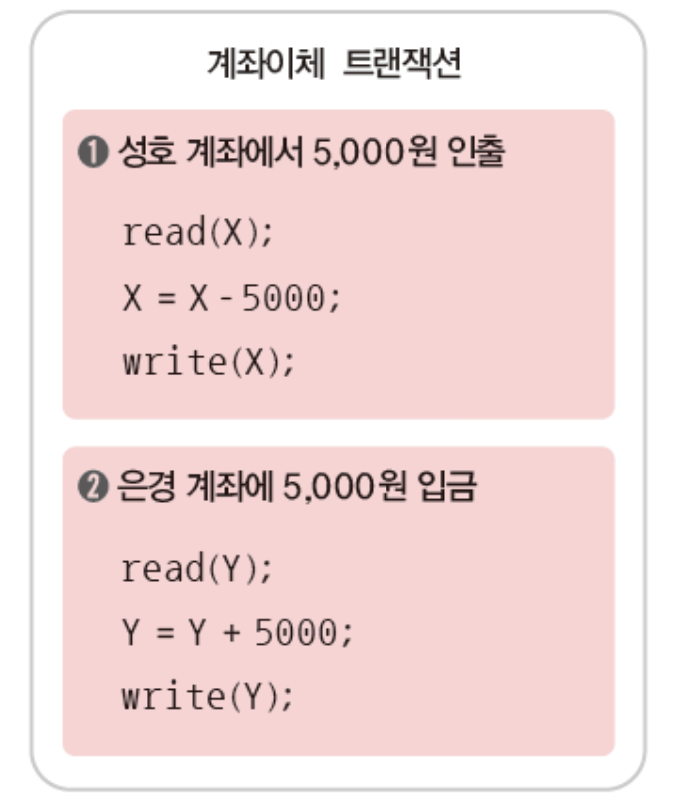

# 장애와 회복

## 1. 장애의 유형

> 장애의 유형



<mark style="color:blue;">**의미:**</mark> 트랜잭션 수행 중 오류가 발생하여 정상적으로 수행을 계속할 수 없는 상태

<mark style="color:blue;">**원인:**</mark> 트랜잭션의 논리적 오류, 잘못된 데이터 입력, 시스템 자원의 과다 사용 요구, 처리 대상 데이터의 부재 등



<mark style="color:blue;">**의미:**</mark> 하드웨어의 결함으로 정상적으로 수행을 계속할 수 없는 상태

<mark style="color:blue;">**원인:**</mark> 하드웨어 이상으로 메인 메모리에 저장된 정보가 손실되거나 교착 상태가 발생한 경우 등



<mark style="color:blue;">**의미:**</mark> 디스크 장치의 결함으로 디스크에 저장된 데이터베이스의 일부 혹은 전체가 손상된 상태

<mark style="color:blue;">**원인:**</mark> 디스크 헤드의 손상이나 고장 등



## 2. 데이터베이스의 저장 연산

### **2-1. 데이터베이스를 저장하는 저장 장치의 종류**



<mark style="color:blue;">**의미:**</mark> 장애가 발생하면 저장된 데이터가 손실됨

<mark style="color:blue;">**예:**</mark> 메인 메모리 등



<mark style="color:blue;">**의미:**</mark> 장애가 발생해도 저장된 데이터가 손실되지 않음. 단, 디스크 헤더 손상 같은 저장 장치 자체에 이상이 \
발생하면 데이터가 손실될 수 있음

<mark style="color:blue;">**예:**</mark> 디스크, 자기 테이프, CD/DVD 등



<mark style="color:blue;">**의미:**</mark> 비휘발성 저장 장치를 이용해 데이터 복사본 여러 개를 만드는 방법으로, 어떤 장애가 발생해도 데이터가 손실되지 않고 데이터를 영구적으로 저장할 수 있음



### **2-2. 트랜잭션의 수행을 위해 필요한 데이터 이동 연산**

* 일반적으로 데이터베이스는 비휘발성 저장 장치인 디스크에 상주함
* 저장 장치 간의 데이터 이동 연산은 <mark style="color:blue;">블록(block) 단위로 수행됨</mark>
  * 디스크 블록: 디스크에 있는 블록
  * 버퍼 블록: 메인 메모리에 있는 블록

#### <mark style="color:blue;">디스크</mark>와 <mark style="color:blue;">메인 메모리</mark> 간 데이터 이동 연산



디스크 블록에 저장되어 있는 데이터 X를 메인 메모리 버퍼 블록으로 이동시키는 연산



메인 메모리 버퍼 블록에 있는 데이터 X를 디스크 블록으로 이동시키는 연산



#### <mark style="color:blue;">메인 메모리</mark>와 <mark style="color:blue;">변수</mark> 간의 데이터 이동 연산



메인 메모리 버퍼 블록에 저장되어 있는 데이터 X를 프로그램의 변수로 읽어오는 연산



프로그램의 변수 값을 메인 메모리 버퍼 블록에 있는 데이터 X에 기록하는 연산



> **트랜잭션을 데이터 이동 연산을 포함한 프로그램으로 표현한 예**

********

## **3.** 회복 기법

****
