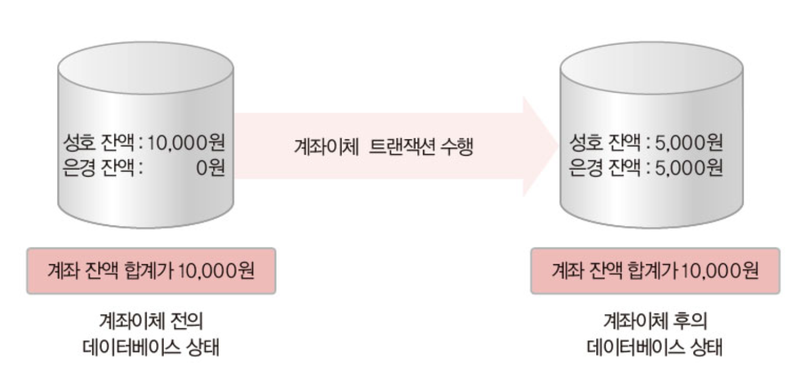

# 트랜잭션

## 1. 트랜잭션 개념

### 1-1. 트랜잭션(transaction)이란?

* <mark style="color:red;">하나의 작업을 수행하는데 필요한 데이터베이스 연산들을 모아 놓은 것</mark>
* 작업 수행에 필요한 SQL 문들의 모임
  * 특히, 데이터베이스를 변경하는 INSERT, DELETE, UPDATE 문의 실행을 관리함\

* 논리적인 작업의 단위
* 장애 발생시 복구 작업이나 병행 제어 작업을 위해, 중요한 단위로 사용됨\

* 데이터베이스의 무결성과 일관성을 보장하기 위해, 작업 수행에 필요한 연산들을 하나의 트랜잭션으로 제대로 정의하고 관리해야 함

### 1-2. 트랜잭션의 예

 

## 2. 트랜잭션의 특성 - ACID

### 2-1. 원자성(atomicity)

* <mark style="color:red;">트랜잭션의 연산들이 모두 정상적으로 실행되거나 혹은 하나도 실행되지 않아야하는 all-or-nothing 방식을 의미</mark>\ <mark style="color:red;"></mark>
* 만약 트랜잭션 수행 도중 장애가 발생하면?
  * 지금까지 실행한 연산 처리를 모두 취소하고, 데이터베이스를 트랜잭션 작업 전 상태로 되돌려야함\

* 원자성의 보장을 위해 장애 발생 시 회복 기능이 필요함
* **완료된 트랜잭션이 갱신한 사항은 트랜잭션의 영향을 재수행함으로써 트랜잭션의 원자성을 보장함**

 .png>)

### 2-2. 일관성(consistency)

* 트랜잭션이 성공적으로 수행된 후에도 데이터베이스가 일관된 상태를 유지해야 함을 의미함

 

### 2-3. 격리성(isolation), 고립성

* 한 트랜잭션이 데이터를 갱신하는 동안, 이 트랜잭션이 완료되기 전에는 갱신 중인 데이터를 다른 트랜잭션들이 접근하지 못하도록 해야함
* 여러 트랜잭션이 동시에 수행되더라도 마치 순서대로 하나씩 수행되는 것처럼 정확하고 일관된 결과를 얻을 수 있도록 제어하는 기능이 필요함\

* DBMS의 <mark style="color:red;">병행 제어 모듈</mark>이 트랜잭션의 격리성을 보장함
  * DBMS는 응용들의 요구사항에 따라 **다양한 격리 수준(isolation level)**을 제공함

 

### 2-4. 지속성(durability)

* 트랜잭션이 성공적으로 완료된 후 데이터베이스에 반영한 수행 결과는 영구적이어야 함을 의미함
  * 완료된 트랜잭션의 효과는 시스템이 고장난 경우에도 데이터베이스에 반영됨\

* 지속성의 보장을 위해서는 장애 발생 시 <mark style="color:red;">회복 기능</mark>이 필요함\

* DBMS의 회복 모듈은 시스템이 다운되는 경우에도, 트랜잭션의 지속성을 보장함
