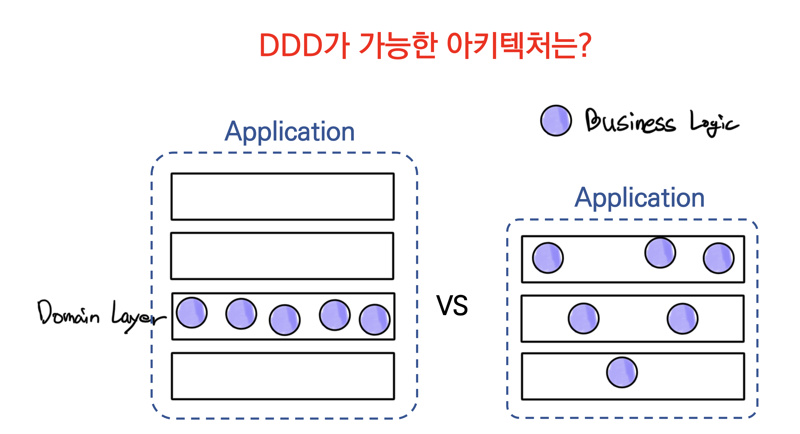
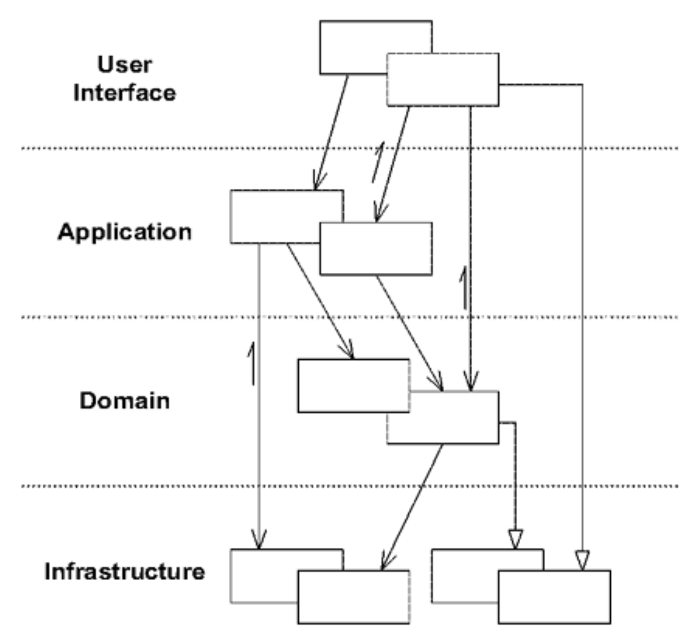

# 도메인의 격리

* 도메인과 관련된 문제를 해결하는 부분은 그것의 중요성과 다르게 전체 시스템의 극히 작은 부분을 차지함
* 도메인과 관련이 적은 기능으로부터 도메인 객체를 분리할 필요가 있음
* 이를 통해 도메인 개념을 다른 기술에만 관련된 개념과 혼동하거나, 시스템이라는 하나의 큰 덩어리 안에서 도메인에 대한 통찰을 잃어버리는 문제를 해결할 수 있음\

* <mark style="color:red;">**계층형 아키텍처(layered architecture)**</mark>는 도메인 격리를 위한 기법 중 하나임
* 도메인 모델링 원칙을 성공적으로 적용하기 위해, 도메인 주도 관점에서 검토해볼 필요가 있음

## 1. 계층형 아키텍처

* 객체지향 프로그램에서 종종 UI, 데이터베이스 혹은 기타 보조적인 성격의 코드를 비즈니스 객체 안에 직접 작성하기도 함
* 부가적인 비즈니스 로직은 UI 위젯과 데이터베이스 스크립트에 포함되기도함
* 그 이유는 단기적으로 무언가를 동작하게 하는 가장 쉬운 방법이기 때문임\

* 도메인 관련 코드가 다른 대다수의 코드를 통해 확산되면, 보기도 추론하기도 매우 어려워짐
* UI를 표면적으로 변경하는 것이 비즈니스 로직을 변경하는 것으로 이어질 수 있음
* 비즈니스 로직을 변경하고자 UI 코드, 데이터베이스 코드 또는 다른 프로그램 요소를 세심하게 추적해야할지도 모름
* 응집력 있고 모델 주도적인 객체를 구현하는 것이 먼나라의 이야기가 돼버리고 자동화 테스트가 어려워짐\

* 매우 복잡한 작업을 처리하는 소프트웨어를 개발할 경우, 관심사 분리(separation of concern)가 필요함
* 이로써 격리된 각 설계 요소에 집중할 수 있음
* 이와 동시에 시스템 내의 상호작용은 분리와는 상관없이 유지되어야함\

* 시스템을 분리하는 방법은 다양하지만 경험과 관례에 근거하여 산업계에서는 <mark style="color:red;">**계층형 아키텍처**</mark>, 좀 더 구체적으로는 <mark style="color:red;">**몇 개의 일반화된 계층**</mark>이 널리 받아들여지고 있음
* **계층화의 핵심 원칙은 한 계층의 모든 요소는 오직 같은 계층에 존재하는 다른 요소나 계층상 ‘아래’에 위치한 요소에만 의존한다는 것**
* 계층화의 가치는 각 계층에서 특정 측면 만을 전문적으로 다룬다는 것
* 이러한 전문화를 토대로 각 측면에서는 더욱 응집력 있는 설계가 가능해짐\

* 경험과 관례를 바탕으로 널리 받아들여지는 계층이 어느 정도 정해져있음
* 계층화는 다양한 모습으로 나타나지만 대다수의 성공적인 아키텍처에서는 아래의 네 가지 개념적 계층으로 나뉨:



사용자에게 정보를 보여주고 사용자의 명령을 해석하는 일을 책임진다. **간혹 사람이 아닌 다른 컴퓨터 시스템이 외부 행위자가 되기도 한다.**



소프트웨어가 수행할 작업을 정의하고 표현력 있는 도메인 객체가 문제를 해결하게 한다. 이 계층에서 책임지는 작업은 업무상 중요하거나 다른 시스템의 응용 계층과 상호작용하는 데 필요한 것들이다.\
이 계층은 얇게 유지된다. 여기에는 비즈니스 규칙이나 지식이 포함되지 않으며, 오직 작업을 조정하고 아래에 위치한 계층에 포함된 도메인 객체에게 작업을 위임한다. 응용 계층에서는 **비즈니스 상황(business situation)을 반영하는 상태가 없지만 사용자나 프로그램의 작업에 대한 진행상황을 반영하는 상태를 가질 수는 있다.**



**업무 개념과 업무 상황에 관한 정보, 업무 규칙을 표현하는 일을 책임진다.** 이 계층에서는 업무 상황을 반영하는 상태를 제어하고 사용하며, 그와 같은 상태 저장과 관련된 기술적인 세부사항은 인프라스터럭처에 위임한다. 이 계층은 업무용 소프트웨어의 핵심이다.



상위 계층을 지원하는 일반화된 기술적 기능을 제공한다. 이러한 기능에는 애플리케이션에 대한 메시지 전송, 도메인 영속화, UI에 위젯을 그리는 것 등이 있다.



* 어떤 프로젝트에서는 사용자 인터페이스와 애플리케이션 계층을 명확히 구분하지 않기도 하며, 여러 개의 인프라스트럭처 계층이 존재하는 프로젝트도 있음
* <mark style="color:red;">**하지만 모델 주도 설계를 가능케 하는 것은 결정적으로 도메인 계층을 분리하는데 있음**</mark>\
  ****
* 복잡한 프로그램을 여러 계층으로 나누어야함
* 응집력 있고 오직 아래에 위치한 계층에만 의존하도록 해야함
* 표준 아키텍처 패턴에 따라 상위 계층과의 결합을 느슨하게 유지해야함
* 도메인 모델과 관련된 코드는 모두 한 계층에 모으고 사용자 인터페이스 코드나 애플리케이션 코드, 인프라스트럭처 코드와 격리해야함
* 이로써 도메인 객체는 도메인 모델을 표현하는 것에만 집중할 수 있음
* **이로써 모델은 진화를 거듭해 본질적인 비즈니스 지식을 포착해서, 해당 비즈니스 지식이 효과를 발휘할 수 있을 만큼 풍부하고 명확해질 것임**

## 2. 도메인 계층은 모델이 살아가는 곳

* 계층형 아키텍처는 오늘날 대부분의 시스템에서 다양한 계층화 방식으로 사용됨
* 많은 개발 스타일은 레이어링의 이점을 얻을 수 있음
* 그러나 도메인 주도 설계에서 요구하는 계층은 하나임\

* 도메인 모델은 일련의 개념을 모아놓은 것
* ‘도메인 계층’은 모델과 설계 요소에 직접적으로 관계되어 있는 모든 것들을 명시한 것
* 도메인 계층은 비즈니스 로직에 대한 설계와 구현으로 구성됨
* <mark style="color:red;">**모델 주도 설계(Model-Driven Design)에서는 도메인 계층의 소프트웨어 구성물이 모델의 개념을 반영함**</mark>\ <mark style="color:red;">****</mark>
* <mark style="color:red;">**도메인 주도 설계의 전제 조건은 도메인 구현을 격리하는 것**</mark>

## 3. 스마트 UI

* 스마트 UI는 UI에 비즈니스 로직을 포함하는 디자인 패턴임
* 여기서 스마트 UI(Smart UI)를 살펴보는 이유는 우리가 왜 애플리케이션으로 부터 도메인을 분리하는지, 그리고 더 중요한 것은 언제 분리하지 않을지를 이해하는데 도움을 얻기 위함임\

* 장점
  * 애플리케이션이 단순한 경우 생산성이 높고 효과가 즉각적으로 나타남
  * 다소 능력이 부족한 개발자도 약간의 교육으로 업무를 진행할 수 있음
  * 간단한 작업만으로도 시스템을 확장하기 수월할 수 있음
  * 관계형 데이터베이스와 잘 어울리고 데이터 수준의 통합이 가능함
* 단점
  * 행위를 재사용하지 않으며 비즈니스 문제에 대한 추상화가 이루어지지 않음
  * 비즈니스 규칙이 적용되는 연산마다 비즈니스 규칙이 중복됨
  * 신속한 프로토타입 작성과 반복주기가 스마트 UI가 지닌 태생적인 한계에 도달할 수 있음
    * 이는 추상화의 부재로 리팩터링의 여지가 제한되기 때문
  * 복잡성에 금방 압도되어 애플리케이션의 성장 방향이 단순히 부가적인 단순 응용으로만 향함
    * 풍부한 행위를 다루기 힘들어짐\

* <mark style="color:red;">**도메인 주도 설계는 야심 찬 프로젝트에 최고의 성과를 가져다 주며, 동시에 매우 탄탄한 기술력을 요함**</mark>
* 모든 프로젝트가 야심 찬 것은 아니며, 모든 프로젝트 팀 역시 그러한 기술을 갖출 수 있는 것도 아님
* 스마트 UI는 여러 이점이 있으며, 스마트 UI가 가장 적합한 상황도 있음\

* 하지만, 스마트 UI는 도메인 주도 설계 기법과는 서로 양립할 수 없는 상호배타적인 길에 놓인 접근법임
* 스마트 UI를 택한다면 DDD와 관련된 대부분의 내용을 적용할 수 없음
* <mark style="color:red;">**팀에서 선택한 아키텍처가 도메인 설계를 시스템의 다른 부분과 느슨하게 결합될 수 있게 도메인 관련 코드를 격리한다면, 도메인 주도 설계를 지원할 수 있음**</mark>
* 복잡한 애플리케이션을 개발하고 있고, 모델 주도 설계를 하기로 했다면 고통을 감내하고 전문가를 확보해야함

> 발표자료


