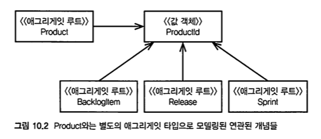

# 애그리거트

> **변경에 대한 불변식을 유지하기 위해 하나의 단위로 취급되면서 변경의 빈도가 비슷하고,** \
> **동시 접근에 대한 잠금의 단위가 되는 객체의 집합을 AGGREGATE라고 한다.**

에릭 에반스는 _AGGREGATE_ 패턴에 대한 규칙을 다음과 정리하고 있다.

* _ENTRY POINT_는 전역 식별자(global identity)를 가지며 궁극적으로 불변식(invariant)을 검증하는 책임을 가진다.
* _AGGREGATE_ 내부에 속한 _REFERENCE OBJECT_들은 지역 식별자를 가지며, 지역 식별자는 _AGGREGATE_내부에서만 유일하다.
* _AGGREGATE_ 경계 외부에 있는 어떤 객체도 _ENTRY POINT_ 이외의 _AGGREGATE_ 내부 객체를 참조할 수 없다. _ENTRY POINT_는 내부에 속한 _REFERENCE OBJECT_를 외부에 전달할 수는 있지만 이를 전달 받은 객체는 일시적으로만 사용할 뿐 이에 대한 참조를 유지하지 않는다. _ENTRY POINT_는 _VALUE OBJECT_에 대한 복사본을 다른 객체에게 전달할 수 있다. _VALUE OBEJCT_는 단지 값을 뿐이며, _VALUE OBJECT_는 _AGGREGATE_와 연관관계를 가지지 않기 때문에 _VALUE OBJECT_에 어떤 일이 발생하는지에 대해서는 신경 쓰지 않는다.
* 위 규칙으로부터 오직 _ENTRY POINT_ 만이 _REPOSITORY_로 부터 직접 얻어질 수 있다는 사실을 유추할 수 있다. 모든 다른 객체들은 _ENTRY POINT_로 부터의 연관 관계 항해를 통해서만 접근 가능하다.
* _AGGREGATE_ 내부의 객체들은 다른 _AGGREGATE_의 _ENTRY POINT_를 참조할 수 있다.
* 삭제 오퍼레이션은 _AGGREGATE_ 내부의 모든 객체를 제거해야 한다.(가비지 컬렉션을 가진 언어의 경우 이 규칙을 준수하는 것이 용이하다. _AGGREGATE_ 외부의 어떤 객체도 _ENTRY POINT_를 제외한 내부 객체를 참조하지 않기 때문에 _ENTRY POINT_를 제거하면 이에 수반된 모든 내부 객체가 제거될 것이다.)
* _AGGREGATE_ 내부의 어떤 객체에 대한 변경이 확약되면, 전체 _AGGREGATE_에 관한 모든 불변식이 만족되어야 한다.


* 애그리거트를 잘못 모델링하는 방식에는 여러 가지가 있음
* 컴포지션의 편의에 맞춰 설계하다 보면 애그리거트를 너무 크게 만들어버리는 함정에 빠질 수 있음
* 반대로 너무 작은 애그리거트를 만들어 내어 진정한 불변식(invariant)를 보호하지 못하는 경우도 있음
* 앞으로 살펴 보겠지만, **양극단의 경우를 모두 피하면서 비즈니스 규칙에 주의를 기울여야함**

## 스크럼 핵심 도메인에서 애그리거트 사용하기


**프로젝트 관리 서비스: 프로젝트오베이션**


예제로 활용할 프로젝트 오베이션은 애자일 기반의 프로젝트 관리 서비스를 제공하는 애플리케이션이다. 서비스는 구독 형태로 제공되며, 이를 구독하는 각 조직은 **테넌트**라고 지칭한다. 전통적인 스크럼 프로젝트 관리 모델에 따라 **제품**, **제품 소유자**, **팀**, **백로그 항목**, **계획된 릴리즈**, **스프린트** 등을 통해 이루어진다.



* 성능과 확장성에 대한 요구사항을 포함하고 있는 이 도메인의 개념은 기존에 이 팀이 직면했던 다른 문제보다 더 복잡했음
* 이런 문제를 처리하기 위해 이 팀이 사용한 DDD의 전술적 도구가 바로 **애그리거트**였음
* 최선의 객체 클러스터(=애그리거트)를 선정하는 방법은 무엇일까?
  * **이 장에서 구하고자 하는 최종적인 답**
* 애그리거트 패턴은 컴포지션을 다루며 정보 은닉을 가능케 하는데, 팀은 이런 측면을 이미 이해하고 있었음
* 하지만 애그리거트는 **일관성 경계(conistency boundary)**와 **트랜잭션**도 함께 다루게 되는데, 이 부분에 관해서는 그리 고민하지 않았음
  * **설계 초기에, 잘못된 애그리거트를 정의하게된 결정적인 계기**

### 첫 번째 시도: 큰 클러스터의 애그리거트

* **팀은 요구사항의 첫 번째 문장인 ‘제품이 아이템, 릴리즈, 스프린트를 포함한다.’라는 부분에 중점을 뒀으며**, 이는 도메인의 애그리거트를 설계하는 초기 시도에 영향을 미쳤음
  * **함정.**
* 객체들은 객체 그래프 처럼 상호 연결돼야 했으며, 동시에 해당 객체의 수명주기를 유지관리하는 일도 아주 중요했음
* 이 결과 `Product`는 아주 큰 애그리거트로 모델링되었음
* 루트인 `Product`는 모든 `BacklogItem`, 모든 `Release`, 관련된 모든 `Sprint` 인스턴스를 포함함

```java
public class Product extends ConcurrencySafeEntity {
    private Set<BacklogItem> backlogItems;
    private String description;
    private String name;
    private ProductId productId;
    private Set<Release> releases;
    private Set<Sprint> sprints;
    private TenantId tenantId;
    ...
}
```


* **크기가 큰 애그리거트는 처음엔 그럴싸해 보였지만, 실제론 실용적이지 않음**
* 다수의 사용자 환경에서 애플리케이션을 실행하면, **트랜잭션이 주기적으로 실패하기 시작했음**
  * 하나의 트랜잭션에서 다루는 데이터의 범위가 너무 넓기 때문
  * `Product`, `BacklogItem`, `Release`, `Sprint`
* 애그리거트 인스턴스는 **낙관적 동시성(optimistic concurrency)**을 활용하여 영속성 객체를 보호하며, 데이터베이스의 락 사용을 피했음
* 이 접근법은 애그리거트 고정자를 동시에 발생하는 변경으로부터 보호하는 중요한 역할을 함


* 하지만 사용자 수가 많아지면 문제는 더 커짐
* **프로덕트에 대한 단 하나의 요청을 제외한 나머지 모든 요청이 실패함**
* 새 백로그 항목을 추가하는 것은 새로운 릴리즈 일정의 수립과 논리적으로 아무런 상관이 없음
* 이는 실제 비즈니스 규칙에 기반하지 않은 잘못된 고정자를 기준으로 설계 했기 때문임
* **이런 설계는 트랜잭션의 문제를 일으킬 뿐 아니라, 성능과 확장성의 측면에서도 안 좋은 영향을 미침**

### 두 번째 시도: 다수의 애그리거트



* 이제 위 그림에서 나온 대안을 알아볼 것임
* 여기에는 네 가지 애그리거트가 있으며, 공통의 `ProductId`를 통한 추론을 거쳐 각 의존성이 연결됨

> 첫 번째 시도였던 ‘큰 클러스터의 애그리거트 설계'에선 메서드 시그니처가 아래와 같은 모습이었음


**Reference**

* [Implementing Domain-Driven Design - Vaughn Vernon](https://books.google.co.kr/books/about/Implementing\_Domain\_Driven\_Design.html?id=X7DpD5g3VP8C\&source=kp\_book\_description\&redir\_esc=y)
* [Domain-Driven Design의 적용-2.AGGREGATE와 REPOSITORY - 조영호](http://aeternum.egloos.com/1144679)
* [Aggregate Design: Using Invariants as a Guide - Derek Comartin](https://codeopinion.com/aggregate-design-using-invariants-as-a-guide/)
