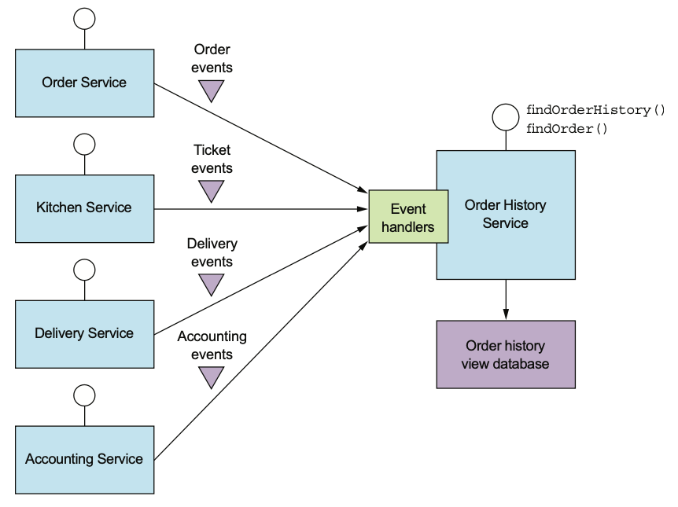

# 마이크로서비스 쿼리 구현

* 마이크로서비스로 전환 시 고민해야 할 분산 데이터 관련 문제가 트랜잭션만 있는 것은 아님
* 쿼리를 구현하는 방법도 찾아내야함

* DB가 하나뿐인 모놀리식 애플리케이션에서는 비교적 쉽게 쿼리를 구현했음
* 개발자가 할 일은 SELECT 문을 작성하고 필요한 인덱스를 정의하는 작업 정도였음
* 하지만 마이크로서비스에서는 여러 서비스, 여러 DB에 분산된 데이터를 조회해야함
* 기존 분산 쿼리 메커니즘(?)은 기술적으로 가능하다 해도 캡슐화에 위배되기 때문에 사용할 수 없음

* 마이크로서비스 아키텍처에서는 다음 두 가지 패턴으로 쿼리를 구현함
* <mark style="color:blue;">**API 조합 패턴(API Composition Pattern)**</mark>: 서비스 클라이언트가 데이터를 가진 여러 서비스를 직접 호출하여 그 결과를 조합하는 패턴. 가장 단순한 방법으로 가급적 이 방법을 쓰는 것이 좋음
* <mark style="color:blue;">**CQRS 패턴(Command Query Responsibility Segregation)**</mark>: 쿼리만 지원하는 하나 이상의 뷰 전용 DB를 유지하는 패턴. API 조합 패턴보다 강력한 만큼 구현하기는 더 복잡함

## 1. API 조합 패턴

> 본 절에서는 여러 서비스에 있는 데이터를 조회하는 쿼리를 구현할 때 어떤 문제점이 있는지, API 조합 패턴을 어떻게 구현해야하는지 기술함

### 1.1 여러 서비스에 걸친 쿼리

* `findOrder()`는 기본키로 주문 정보를 조회하는 메서드이며, `orderId`를 매개변수로 받아 주문 내역이 포함된 `OrderDetails` 객체를 반환함
* 모바일 기기 또는 웹 애플리케이션 등의 프론트엔드 모듈(frontend module)이 이 메서드를 호출함
* 주문과 관련된 데이터가 여러 서비스에 흩어져 있으므로, 모든 서비스에 요청을 해야함

### 1.2 API 조합 패턴 개요

* API 조합 패턴은 API 조합기와 둘 이상의 프로바이더 서비스로 구성됨
  * <mark style="color:blue;">**API 조합기(API composer)**</mark>: 프로바이더 서비스를 쿼리하여 데이터를 조회함. 웹 페이지에 데이터를 렌더링 하는 클라이언트, API 게이트웨어, 프론트엔드를 위한 백엔드 패턴의 변형일 수도 있음
  * <mark style="color:blue;">**프로바이더 서비스(provider service)**</mark>: 최종 결과로 반환할 데이터의 일부를 가지고 있는 서비스
* API 조합기는 프로바이더를 쿼리해서 반환된 결과를 조합함

### 1.3 API를 조합 패턴으로 쿼리 구현

* `findOrder()`는 단순히 기본키로 EQUI 조인해서 쿼리하는 작업임
* `orderId`로 필요한 데이터를 가져올 수 있는 API 끝점은 각 프로바이더 서비스가 당연히 제공하리라 볼 수 있기 때문에 API 조합 패턴으로 구현하기에 제격임

* 여기서 API 조합기는 쿼리를 REST 끝점으로 표출한 서비스임
* HTTP 대신 gRPC 같은 다른 IPC 프로토콜을 사용하는 서비스 역시 개념은 같음
* 주문 검색 조합기는 `orderId`로 네 서비스를 호출한 후 수신한 응답을 조인함

### 1.4 API 조합 설계 이슈

* API 조합 패턴에는 다음 두 가지 설계 이슈가 있음
  * 어느 컴포넌트를 쿼리 작업의 API 조합기로 선정할 것인가?
  * 어떻게 해야 효율적으로 취합 로직을 작성할 것인가?

#### 누가 API 조합기 역할을 맡을 것인가?

API 조합기 역할을 누가 맡을지 선택하는데 있어, 세 가지 옵션이 있음



* 주문 상태 뷰를 구현한 웹 애플리케이션 같은 클라이언트가 동일한 LAN에서 실행 중이라면 가장 효율적으로 주문 내역을 조회할 수 있음
* 하지만 클라이언트가 방화벽 외부에 있고 서비스가 위치한 네트워크가 느리다면 그리 실용적이지 않음

.png>)



* 쿼리 작업이 작업이 애플리케이션의 외부 API 중 일부라면 이 방법이 타당함
* 다른 서비스(=스탠드얼론 서비스)로 요청을 보내는 대신 차라리 API 게이트웨이에 API 조합 로직을 구현하는 것
* 모바일 기기 등 방화벽 외부에서 접근하는 클라이언트가 API 호출 한 번으로 여러 서비스의 데이터를 조회할 수 있기 때문에 효율적임




* 내부적으로 여러 서비스가 사용하는 쿼리 작업이라면 좋은 방법임
* 취합 로직이 너무 복잡해서 API 게이트웨이 일부로 만들기는 곤란하고, 외부에서 접근 가능한 쿼리 작업을 구현할 경우에도 좋은 방법임




#### API 조합기는 리액티브 프로그래밍 모델을 사용해야 한다

* 분산 시스템을 개발할 때 지연 시간을 최소화하는 문제는 항상 골칫거리임
* 쿼리의 응답 시간을 최대한 줄이려면 가능한 한 API 조합기가 프로바이더 서비스를 병렬 호출해야함
* 하지만 어떤 프로바이더 서비스를 호출하기 위해 다른 프로바이더 서비스의 결과를 먼저 가져와야하는 경우도 있음
* 이때는 일부 프로바이더 서비스를 순차 호출해야함

* 그러나 순차/병렬 서비스 호출이 뒤섞인 실행 로직은 복잡해질 수 있음
* <mark style="color:blue;">**관리가 용이하고 성능/확장성이 우수한 API 조합기를 작성하려면 리액티브 설계 기법을 동원해야함**</mark>
  * Ex) CompleteFuture, RxJava, 또는 이와 동등한 추상체

### 1.5 API 조합 패턴의 장단점

API 조합 패턴은 마이크로서비스 아키텍처에서 아주 쉽고 단순하게 쿼리 작업을 구현할 수 있게 해주지만, 다음과 같은 단점도 있음:



* 여러 서비스를 호출하고 여러 DB를 쿼리하는 오버헤드는 불가피함
* 모놀리식에서는 클라이언트가 요청 한 번으로, 그것도 대부분 DB 쿼리문 하나로 필요한 데이터를 조회함
* 하지만 API 조합 패턴은 여러번 요청하고 여러 DB 쿼리를 실행해야함
* 따라서 그만큼 컴퓨팅/네트워크 리소스가 더 많이 소모되고 애플리케이션 운영 비용도 늘어남



* 어떤 작업의 가용성은 더 많은 서비스가 개입할수록 감소함
* 하나의 쿼리 작업에 최소한 세 서비스가 반드시 개입되는 구조라서 하나의 서비스로 처리하는 것에 비해 가용성은 현저히 낮음
* 각 서비스의 가용성이 99.5%이면, 프로바이더 서비스 4개를 호출하는 요청의 가용성은 97.5%가됨


<mark style="color:blue;">**가용성을 높이는 전략으로 두 가지**</mark>

첫째, 프로바이더 서비스가 불능일 경우 API 조합기가 이전에 캐시한 데이터를 반환하는 것

* 성능 향상을 목적으로 API 조합기에 캐시된, 프로바이더 서비스의 반환 데이터를 잘 활용하면 가용성을 향상시킬 수 있음
* 프로바이더 서비스가 내려가더라도 API 조합기는(오래 되어 맞지 않는 데이터도 있겠지만) 캐시 데이터를 반환할 수 있음

둘째, API 조합기가 미완성된 데이터를 반환하는 것

* 가령 주방 서비스가 일시 불능 상태가 되면, 주문 검색 조합기가 이 서비스의 데이터만 제외한 나머지 데이터를 반환함
* 특정 데이터가 없어도 UI에서 유용한 정보를 표시하는 데에 별 지장이 없는 경우 활용할 수 있음




* 모놀리식 애플리케이션은 대부분 한 트랜잭션으로 쿼리를 수행함
* ACID 트랜잭션은 애플리케이션이 여러 DB 쿼리를 실행해도 데이터를 일관되게 바라볼 수 있게 보장함
* <mark style="color:blue;">**그러나 API 조합 패턴은 여러 DB를 대상으로 여러 쿼리를 실행하기 때문에 일관되지 않은 데이터가 반환될 수있음**</mark>



* 이런 단점에도 API 조합 패턴은 꽤 많은 쿼리 기능을 쉽게 구현할 수 있는 수단으로 아주 유용함
* 하지만 효율적으로 구현하기 어려운 (가령 거대한 데이터 뭉치를 인-메모리 조인하는) 쿼리 작업은 CQRS 패턴으로 구현하는 편이 바람직함

## 2. CQRS 패턴

* CQRS는 API 조합 패턴으로는 효율적으로 구현하기 어려운 쿼리 때문에 각광받기 시작했음
* 하나 이상의 쿼리가 구현된 하나 이상의 뷰 DB를 유지함

### 2.1 CQRS의 필요성

* API 조합 패턴을 이용하면 여러 서비스에 있는 데이터를 조회하는 쿼리를 쉽게 구현할 수 있음
* 하지만 API 조합은 마이크로서비스 아키텍처의 쿼리 문제를 해결하는 반쪽짜리 솔루션에 불과함
* 이 패턴만으로는 효율적으로 구현하기 어려운 다중 서비스 쿼리가 많기 때문
* 단일 서비스 쿼리조차도 구현하기 어려운 경우도 있고, DB가 효율적인 쿼리를 지원하지 않는 경우도 있음

#### 다중 서비스 쿼리 구현

* findOrderHistory()는 아래의 매개변수르 ㄹ받아 소비자의 주문 이력을 조회하는 쿼리 작업임
  * customerId: 소비자 식별자
  * OrderHistoryFilter: 필터 조건
    * 어느 시점 이후 주문까지 반환할 것인가(필수)
    * 주문 상태(옵션)
    * 음식점명 및 메뉴 항목을 검색할 키워드(옵션)

* 모든 서비스가 필터/정렬 용도의 속성을 보관하는 것이 아님
* 이를테면 findOrderHistory()의 OrderHistoryFilter에는 메뉴 항목과 매치할 keywords라는 속성이 있음
* 하지만 배달 서비스와 회계 서비스는 메뉴 항목을 저장하지 않음

* API 조합기는 이 문제를 두 가지 방법으로 해결할 수 있음
* 첫째, API 조합기로 데이터를 인-메모리 조인하는 것
* 어떤 소비자의 모든 주문 데이터를 배달 서비스, 회계 서비스에서 가져온 후 주문 서비스, 주방 서비스에서 가져온 데이터와 조인하는 것
* 그러나 거대한 데이터 뭉치를 이런 식으로 API 조합기에서 조인하면 급격히 효율이 떨어질 것임

.png>)

* 둘째, API 조합기로 주문 서비스, 주방 서비스에서 데이터를 조회하고, 주문 ID를 이용하여 다른 서비스에 있는 데이터를 요청하는 것
* 하지만 이는 해당 서비스가 대량 조회 API를 제공할 경우에만 현실성이 있는 방법임
* 그렇다고 주문 데이터를 하나하나 요청하는 것은 과도한 네트워크 트래픽이 유발되므로 비효율적임

#### 어려운 단일 서비스 쿼리 구현

* 여러 서비스에서 데이터를 가져오는 쿼리만 어려운 것이 아니라, 하나의 서비스에 국한된 쿼리도 구현하기 어려운 경우가 있음, 그 이유는...
* 첫째, 데이터를 가진 서비스에 쿼리를 구현하는 것이 부적절한 경우가 있기 때문
* 둘째, 서비스 DB가 (또는 데이터 모델이) 효율적인 쿼리를 지원하지 않기 때문

#### 관심사를 분리할 필요성

* 단일 서비스 쿼리가 구현하기 까다로운 또 다른 이유는 데이터를 가진 서비스에 쿼리를 구현하면 안 될 때가 있기 때문
* `findAvailableRestaurants()`는 음식점 서비스에 있는 데이터를 조회하는 쿼리임
* 음식점 서비스는 음식점 프로필, 메뉴 항목 등을 음식점에서 관리할 수 있게 해주는 서비스임
* 언뜻 보면 마땅히 음식점 데이터를 가진 음식점 서비스에 쿼리를 구현해야 할 것처럼 느껴지지만, 이는 데이터 소유권만 보고 판단할 문제는 아님

* 관심사를 어떻게 분리하면 좋을지, 어느 한 서비스에 너무 많은 책임을 부과하지 않으려면 어떻게 해야 할까 하는 문제도 함께 고민해야함
* 가령 음식점 서비스 개발 팀의 주 임무는 음식점 주인이 음식점을 잘 관리할 수 있게 해주는 서비스를 개발하는 일이지, 성능이 매우 중요한 대용량 데이터를 조회하는 쿼리를 구현하는 일은 아닐 것임
* 만약 이 팀의 개발자가 해당 기능을 담당할 경우, 나중에 자신이 변경한 코드를 배포하면 만에 하나 소비자가 주문을 못 하게 되지는 않을까 걱정하며 늘 불안에 시달리게 될 것임

### 2.2 CQRS 개요

* 앞서 기술한 내용을 정리하면 쿼리를 구현할 때 흔히 다음 세 가지 난관에 봉착하게 됨
  * API를 조합하여 여러 서비스에 흩어진 데이터를 조회하려면 값비싸고 비효율적인 인-메모리 조인을 해야함
  * 데이터를 가진 서비스는 필요한 쿼리를 효율적으로 지원하지 않는 DB에, 또는 그런 형태로 데이터를 저장함
  * 관심사를 분리할 필요가 있다는 것은 데이터를 가진 서비스가 쿼리 작업을 구현할 장소로 적합하지 않다는 뜻임
* 이 세가지 문제를 해결할 수 있는 묘안이 바로 CQRS 패턴임

#### CQRS는 커맨드와 쿼리를 서로 분리한다

* CQRS(커맨드 쿼리 책임 분리)는 이름처럼 관심사의 분리/구분에 관한 패턴임
* 이 패턴에 따르면 영속적 데이터 모델과 그것을 사용하는 모듈을 커맨드와 쿼리, 두 편으로 가름
* 조회(R) 기능은 쿼리 쪽 모듈 및 데이터 모델에,
* 생성/수정/삭제(CUD) 기능은 커맨드 쪽 모듈 및 데이터 모델에 구현하는 것임
* 양쪽 데이터 모델 사이의 동기화는 커맨드 쪽에서 발행한 이벤트를 쿼리 쪽에서 구독하는 식으로 이루어짐

* CQRS 패턴과 상관없이 거의 모든 서비스는 다양한 CRUD 작업이 구현된 API를 가지고 있음
* 비CQRS 서비스에서는 이런 작업을 보통 DB에 매핑된 도메인 모델로 구현함
* 성능이 중요한 쿼리는 도메인 모델을 건너뛰고 직접 DB에 접속하기도 함
* 하나의 영속적 데이터 모델은 커맨드와 쿼리를 모두 지원함

* CQRS 서비스에서 커맨드 쪽 도메인 모델은 CRUD 작업을 처리하고 자체 DB에 매핑됨
* 조인 없는 단순 쿼리와 기본키 기반의 쿼리도 처리할 수 있음
* 커맨드 쪽은 데이터가 바뀔 때마다(이벤추에이트 트램이나 이벤트 소싱 등의 프에임워크를 이용하여) 도메인 이벤트를 발행함

* 별도로 나뉘어진 쿼리 모델은 다소 복잡한 쿼리를 처리함
* 비즈니스 규칙을 구현할 정도는 아니기 때문에, 그래도 커맨드 쪽보다는 훨씬 단순함
* 쿼리 쪽은 쿼리에 적합한 DB라면 어떠한 종류든 사용할 수 있음
* 또, 쿼리 쪽에는 도메인 이벤트를 구독하고 DB를 업데이트하는 이벤트 핸들러가 있음
* 쿼리 종류마다 쿼리 모델을 하나씩 가진 다중 쿼리 모델도 있음(?)

#### CQRS와 쿼리 전용 서비스

* CQRS는 서비스 내부에 적용할 수 있을 뿐만 아니라, 이 패턴을 이용하여 쿼리 서비스를 정의하는 것도 가능
* 쿼리 서비스에는 커맨드 작업이 전혀 없는 오직 쿼리 작업만으로 구성된 API가 있고, 다른 서비스들이 발행한 이벤트를 구독하여 항상 최신 상태로 유지되는 DB를 쿼리하는 로직이 구현되어 있음
* 쿼리 쪽 서비스는 여러 서비스가 발행한 이벤트를 활용하여 실시간 뷰를 구현하기 좋은 방법임
* 이러한 뷰는 특정 서비스에 종속되지 않기 때문에 스탠드얼론 서비스로 구현하는 것이 타당함

### 2.3 CQRS의 장점



* CQRS 패턴은 여러 서비스의 데이터를 조회하는 쿼리를 효율적으로 구현할 수 있게 해줌
* API 조합 패턴으로 쿼리하면 거대한 데이터 뭉치를 인-메모리 조인하는 값비싸고 비효율적인 작업을 해야함
* 여러 서비스에서 데이터를 미리 조인해 놓는 CQRS 뷰를 이용하는 것이 간편하고 효율적임



* 다양한 쿼리를 애플리케이션/서비스에서 효율적으로 구현할 수 있음
* 단일 영속화 데이터 모델만으로는 갖가지 종류의 쿼리를 지원하기가 쉽지 않고 아예 불가능한 경우도 있음
* 게다가 일부 NoSQL DB는 쿼리 능력이 매우 제한적임
* 특정 유형의 쿼리를 지원하는 확장팩이 DB에 설치되어 있어도 특화된 DB를 사용하는 것이 더 효율적임
* CQRS 패턴을 통해 각 쿼리가 효율적으로 구현된 여러 뷰를 정의하여 단일 데이터 저장소의 한계를 극복할 수 있음



* CQRS는 이벤트 소싱의 중요한 한계(이벤트 저장소는 기본키 쿼리만 지원)를 극복하게 해줌
* CQRS 패턴은 하나 이상의 애그리거트 뷰를 정의하고 이벤트 소싱 기반의 애그리거트가 발행한 이벤트 스트림을 구독하여 항상 최신 상태를 유지함
* <mark style="color:blue;">**때문에 이벤트 소싱 애플리케이션은 거의 예외 없이 CQRS를 사용함**</mark>



* 도메인 모델과 그에 대응되는 영속화 데이터 모델은 커맨드, 쿼리를 모두 처리하지 않음
* CQRS 패턴은 서비스의 커맨드 쪽, 쿼리 쪽에 각각 알맞은 코드 모듈과 DB 스키마를 별도로 정의함
* 이렇게 관심사를 분리하면 커맨드/쿼리 양쪽 모두 관리하기 간편해지는 이점이 있음
* 또 CQRS를 이용하면 쿼리를 구현한 서비스와 데이터를 소유한 서비스를 달리할 수 있음
* 가령 `findAvailableRestaurants()` 쿼리로 조회한 데이터는 음식점 서비스에 있지만, 이렇게 아슬아슬한 대용량 쿼리는 다른 서비스에 구현하는 것이 더 합당함



### 2.4 CQRS의 단점



* 뷰를 조회/수정하는 쿼리 서비스를 작성해야 하며, 별도의 데이터 저장소를 관리해야 하는 운영 복잡도 역시 가중됨
* 종류가 다양한 DB를 사용하는 애플리케이션이라면 개발/운영 복잡도가 더 가중됨



* 커맨드 쪽이 이벤트를 발행하는 시점과 쿼리 쪽이 이벤트를 받아 뷰를 업데이트하는 시점 사이에 지연이 발생
* 일관되지 않은 데이터가 최대한 사용자에게 노출되지 않도록 애플리케이션을 개발해야함


