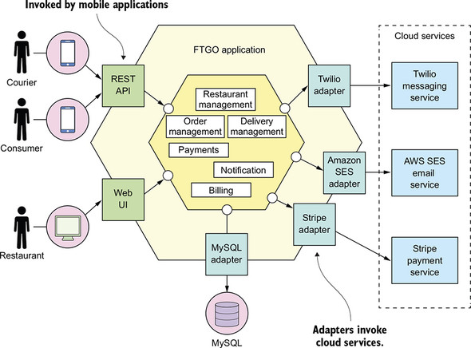
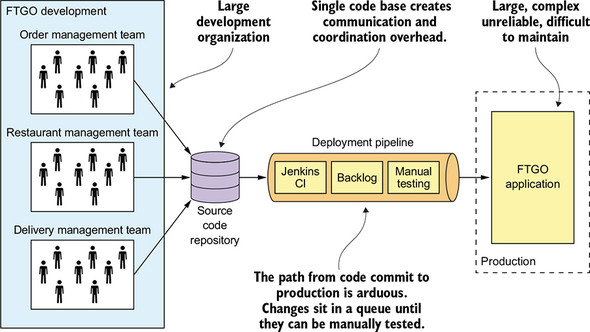
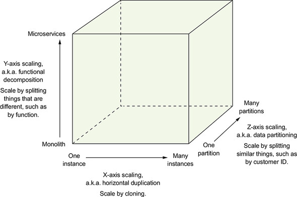
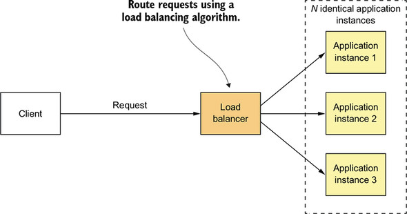
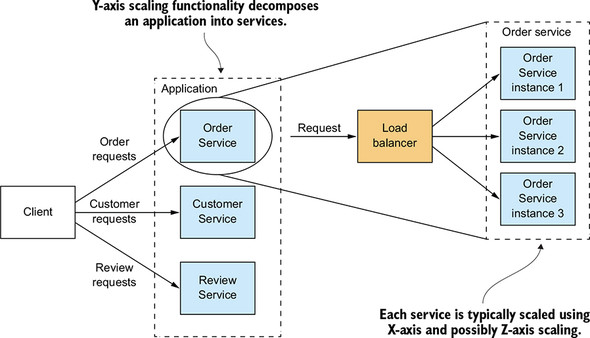

# 모놀리식과 마이크로서비스

## 1. 모놀리식 지옥

> **모놀리식 아키텍처 기반의 애플리케이션은 규모가 커질수록 모놀리식의 단점이 점점 부각되고 장점은 퇴화됨**

### 1-1. FTGO 애플리케이션 아키텍처

* 전형적인 엔터프라이즈 자바 애플리케이션인 FTGO의 전체 구조는 코어가 비즈니스 로직으로 구성된 <mark style="color:red;">**육각형 아키텍처(hexagonal architecture)**</mark>임
* UI 구현 및 외부 시스템 통합을 담당하는 다양한 어댑터가 비즈니스 로직을 감싼 모양새

* 비즈니스 로직은 각자가 도메인 객체 컬렉션인 모듈(예: 주문 관리, 배달 관리, 과금, 지불)로 구성되며, 외부 시스템과 연계하는 어댑터가 여럿 달려있음
* REST API, 웹 UI 어댑터 등 비즈니스 요청을 호출하여 처리하는 <mark style="color:red;">**인바운드 어댑터(inbound adapter)**</mark>가 있음
* MySQL DB에 접속하거나 트윌리오, 스트라이프 등 클라우드 서비스를 호출하게 해주는 <mark style="color:red;">**아웃바운드 어댑터(outbound adapter)**</mark>가 있음\

* **논리적으로는 모듈화한 아키텍처임데도 애플리케이션은 **<mark style="color:red;">**WAR 파일 하나로 패키징**</mark>
* 시스템을 하나의 실행/배포 가능한 컴포넌트로 구성하는 전통전인 소프트웨어 아키텍처 스타일

### 1-2. 모놀리식 아키텍처의 장점

비교적 규모가 작았던 FTGO 영업 초기에는 모놀리식 아키텍처가 장점이 많았음

| 장점                  | 설명                                                                       |
| ------------------- | ------------------------------------------------------------------------ |
| 개발이 간단하다            | IDE 등 개발 툴은 단일 애플리케이션 구축에 초점이 맞추어져 있음                                    |
| 애플리케이션을 쉽게 변경할 수 있다 | 코드, DB 스키마를 변경해서 빌드/배포하기 용이함                                             |
| 테스트하기 쉽다            | 개발자가 애플리케이션을 띄우고, REST API를 호출하고, 셀레늄(Selenuim)으로 UI를 시험하는 종단 간 테스트를 작성함 |
| 배포하기 쉽다             | 개발자는 서버에 접속하여 톰캣 설치 경로에 WAR 파일을 복사하기만 하면됨                                |
| 확장하기 쉽다             | 부하 분산기(load balancer) 뒷면에 애플리케이션 인스턴스를 여러 개 실행함                          |

> **하지만 시간이 흐를수록 개발, 테스트, 배포 확장하기가 점점 어려워짐**

### 1-3. 모놀리식 지옥의 실상

* FTGO 처럼 성공한 애플리케이션은 더 이상 모놀리식 아키텍처라는 옷이 맞지 않게 커짐
* 아키텍처가 몸에 맞지 않게 되니 FTGO는 모놀리식 지옥에 빠져 애자일식 개발/배포도 불가능함

#### 너무 복잡해서 개발자가 주눅 들다

* FTGO 애플리케이션은 여느 개발자가 완전히 이해할 수 없을 정도로 내용이 방대함
* 하여 버그를 고치고 새 기능을 정확하게 구현하기가 갈수록 힘들고 시간도 오래 걸림
* 코드베이스도 이해하기 어려운데, 개발자가 변경분을 정확히 반영할 리 만무함
* 또한 변경할 때마다 코드베이스는 한층 더 복잡하고 난해해짐

#### 개발이 더디다

* 코드베이스 복잡도와 별개로 개발자의 일상적인 개발 업무도 더디게 진행됨
* 애플리케이션이 너무 커져서 개발자 IDE의 실행 속도도 느려지고, 자연히 빌드 시간도 오래 걸림
* 더구나 비대한 몸집에 걸맞게 한 번 시동하는 것도 적잖은 시간이 필요함
* 코드를 고치고 빌드/실행 후 테스트하기까지 너무 많은 시간이 낭비되어 생산성을 떨어뜨리는 요인이됨

#### 커밋부터 배포에 이르는 길고 험난한 여정

* FTGO는 부분적으로 애자일을 도입했고 기술 팀을 여러 소그룹으로 나누어 2주짜리 스프린트를 진행함
* 여러 개발자가 같은 코드베이스에 소스 커밋을 하다 보니 종종 릴리즈할 수 없을 때도 있음
* 한팀이 스프린트를 마치면 곧바로 길고 긴 테스트 및 코드 안정화 기간이 필요
* 테스트 시간이 너무 긴것도 변경분을 프로덕션에 반영하는 데 시간이 많이 걸리는 요인임
* 코드베이스가 너무 복잡하여 변경 영향도가 제대로 파악이 안 되므로 개발자는 CI(Continuous Intergration, 지속적 통합) 서버에서 전체 테스트 스위트를 한 번씩 돌려 보아야함
* 테스트가 실패하면 원인을 찾고 조치하는데 시간이 많이 걸리므로 테스트 한 사이클을 완료하는 데만 2\~3일이나 걸림

#### 확장하기 어렵다

* FTGO 애플리케이션은 모듈마다 리소스(resource, 자원) 요건이 서로 맞지 않아 확장하기 어려움
* 예를 들어, 데이터 용량이 큰 음식점 데이터는 인-메모리 DB 형태로 저장하는데, 이런 DB는 메모리 칩이 많이 장착된 서버에 배포하는 것이 좋음
* 반면에, 이미지 처리 모듈은 CPU를 집중 소모하므로 CPU 코어 수가 많은 서버에 배포하는 것임 최적임
* 이렇게 같은 애플리케이션이라도 리소스 요건이 상이한 모듈이 존재하므로 서버 구성 시 리소스 배분을 신경 써야함

#### 확실하게 전달하기 어렵다

* 애플리케이션 규모가 워낙 커서 철저하게 테스트하기 어렵고, <mark style="color:red;">테스트성(testability)</mark>이 부족하면 결국 프로덕션에 버그가 발생할 가능성이 높음
* 테스트성(테스트 가능성, 가테스트성)은 주어진 테스트 컨텍스트에서 소프트웨어 결과물이 얼마나 테스트하기 쉬운가 하는 정도를 의미함
* 테스트성이 높을수록 자동화 테스트를 수행해서 결함을 찾기 쉽고, 빠르므로 품질 향상에 큰 도움이 됨\
  ****
* 전체 모듈이 같은 프로세스로 실행되는 까닭에 <mark style="color:red;">결함 격리(fault isolation)</mark>가 되지 않고, 그러다 보니 어떤 모듈에 버그 하나만 있어도 메모리 누수가 발행하여 전체 애플리케이션 인스턴스가 내려가는 일도 발생할 수 있음

#### 갈수록 한물간 기술 스택에 발목이 붙잡히다

* 모놀리식은 점점 한물간 기술 스택을 쓸 수밖에 없고, 그 특성상 새로운 프레임워크, 새로운 프로그래밍 언어를 받아들이기 어려움
* 최신 기술을 사용하고자 전체 모놀리식 애플리케이션을 재작성하는 것은 비용도 비용이거니와 리스크가 높기 때문에 개발자는 프로젝트 초기에 결정된 기술을 그냥 따를 수 밖에 없음

## 2. 마이크로서비스 아키텍처란?

* 소프트웨어 아키텍처는 기능 요건과는 거의 무관함
* 애플리케이션 <mark style="color:red;">**기능 요건(functional requirement)**</mark>, 즉 유스 케이스(use case, 용례)는 어느 아키텍처든 구현할 수 있음
* 그러나 '\~성(ilities)'으로 끝나는 갖가지 <mark style="color:red;">**서비스 품질 요건(비기능 요건(nonfunctional requirement))**</mark>은 아키텍처에 적잖이 영향을 받음
* FTGO 애플리케이션은 점점 몸집이 커지면서 여러 가지 품질 속성이 악화되었음
* 그중 <mark style="color:red;">**소프트웨어 전달 속도(관리성(maintainability, 유지보수성), 확장성(extensibility), 테스트성(testability))**</mark>가 가장 큰 영향을 받음\

* 평소 훈련이 잘된 팀은 팀원들이 열심히 노력하면 애플리케이션의 모듈성을 유지하고 종합적인 자동화 테스트를 작성해서 모놀리식 지옥에 빠지는 속도를 늦출 수 있음
* 하지만 규모가 큰 팀에서 여러 사람이 모놀리식 애플리케이션 하나에 달라붙어 작업할 때 일어나는 문제들은 불가피하고, 점점 더 쓰지 않는 기술 스택이 쌓여 가는 문제도 어쩔 도리가 없음

### 2-1. 확장 큐브와 마이크로서비스

* \<The Art of Scalability(확장의 기술)>(Micahel T. Fisher, Martin L. Abbott)라는 책에서 <mark style="color:red;">**확장 큐브라는 3차원 확장 모델**</mark>이 나옴
* 이 모델에 따르면 애플리케이션을 X축, Y축, Z축 세 방향으로 확장시킬 수 있음

#### X축 확장: 다중 인스턴스에 고루 요청 분산

* X축 확장은 일반적인 모놀리식 애플리케이션의 확장 수단임
* 부하 분산기 뒷면에 애플리케이션 인스턴스를 N 개를 띄움
* 분사 분산기는 들어온 요청을 이들 인스턴스에 고루 분배함
* 애플리케이션 능력과 가용성을 개선할 수 있는 방법임

#### Z축 확장: 요청 속성별 라우팅

* 모놀리식 애플리케이션의 다중 인스턴스를 실행하는 것은 X축 확장과 같음
* 하지만, 인스턴스별로 주어진 데이터 하위 집합(subset)만 처리하도록 설정하는 방법임
* 인스턴스 앞면에 위치한 라우터는 요청의 속성에 알맞은 인스턴스로 요청을 라우팅
  * 예. userId에 따라 요청을 분산
* Z축 확장은 증가하는 트랜잭션 및 데이터 볼륨을 처리하기 좋은 수단임

#### Y축 확장: 기능에 따라 애플리케이션을 서비스로 분해

* <mark style="color:red;">**X축/Z축 확장을 하면 애플리케이션 능력과 가용성은 개선되지만, 애플리케이션이 점점 복잡해지는 문제는 해결되지 않음**</mark>
* Y축 확장, 즉 기능 분해가 필요함
* 서비스는 주문 관리, 고객 관리 등 <mark style="color:red;">**지엽적 기능이 구현된 미니 애플리케이션**</mark>임
* 서비스에 따라 X축/Z축 확장도 가능함

.png>)

* <mark style="color:red;">**마이크로서비스 아키텍처**</mark>**는 고수준에서 바라보면 하나의 애플리케이션을 여러 서비스로 기능 분해하는 아키텍처 스타일**
* <mark style="color:red;">**여기서 중요한 것은 크기가 아니라, 각 서비스가 집중된(focused)/응집된(cohesive) 책임을 맡고 있다는 것**</mark>

### 2-2. 마이크로서비스는 모듈성을 갖고 있다

* <mark style="color:red;">**모듈성(modularity)**</mark>은 크고 복잡한 애플리케이션을 개발할 때 꼭 필요한 특성
* **오늘날의 애플리케이션은 규모가 방대하고 내용이 너무 복잡하여 어느 한 개인이 전부 이해하고 개발할 수 없음**
* **마이크로서비스 아키텍처는 서비스를 모듈성의 단위로 사용**\
  ****
* 각 서비스는 다른 서비스가 함부로 규칙을 어기고 침투하지 못하게 API라는 경계선을 가지고 있음
* 따라서 시간이 지나도 애플리케이션의 모듈성을 유지하기 훨씬 수월함
* 또한, 서비스를 빌딩 블록처럼 사용하여 독립적으로 배포/확장할 수 있는 부가적인 장점도 있음

### 2-3. 서비스마다 DB가 따로 있다

* **느슨하게 결합된 각각의 **<mark style="color:red;">**서비스는 자체 DB를 가지고 있음**</mark>
  * 주문 서비스는 _ORDERS_ 테이블이 있는 DB를, 고객 서비스는 _CUSTOMERS_ 테이블이 있는 DB를 각자 소유함
* 이로 인해, 개발 단계에서 다른 서비스 개발자와 일일이 협의하지 않고도 본인이 담당한 서비스 스키마를 변경할 수 있음
* **런타임에** 서비스는 서로 완전히 분리되어 있기 때문에, 다른 서비스가 DB 락을 획득해 내 서비스를 블로킹(blocking, 차단)하는 일 따위는 발생하지 않음

### 2-4. FTGO 마이크로서비스 아키텍처

* 그림은 FTGO 애플리케이션에 Y축 확장을 적용한 것임
* 기능별로 분해된 여러 프런트엔드/백엔드 서비스가 애플리케이션을 이루고 있음
* 런타임에 X축/Z축 확장을 하면 서비스마다 인스턴스가 여럿 존재할 수 있음\

* 비즈니스 로직은 REST API와 자체 프라이빗(private) 데이터 저장소를 소유한 다양한 백엔드 서비스로 구성됨
* 서비스와 API가 아주 분명하게 정의된 것만 다를 뿐, 앞서 소개한 모듈에 그대로 대응됨
* **각 서비스를 **<mark style="color:red;">**독립적으로**</mark>** 개발, 테스트, 배포, 확장할 수 있음**
* 개발자가 타 서비스의 내부 요소에 직접 접근할 수 없기 때문에 모듈성 유지 차원에서도 적합함
