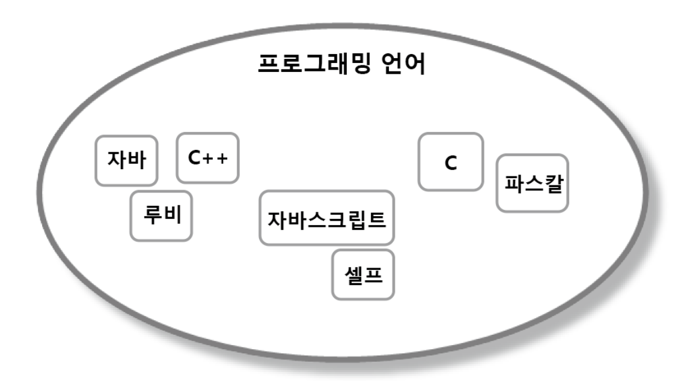
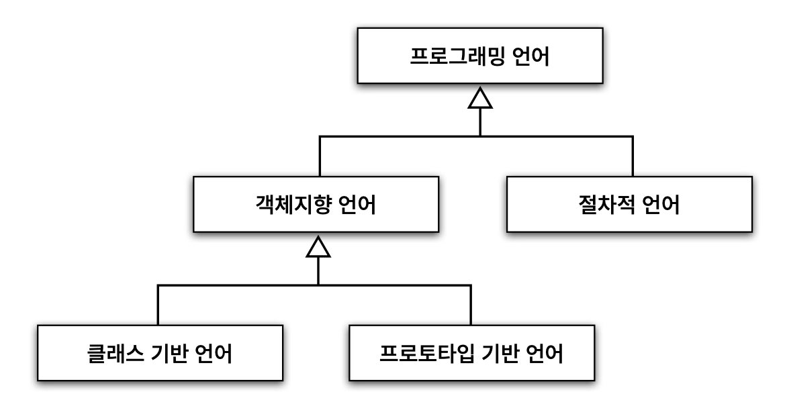
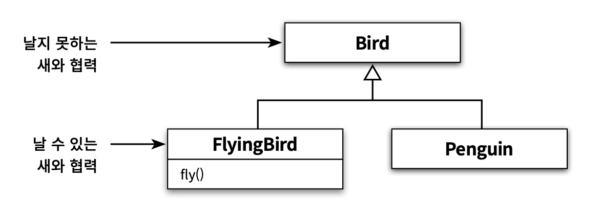

# 서브클래싱과 서브타이핑

> **상속의 용도: 1. 타입 계층 구현 2. 코드 재사용**

* 상속의 첫 번째 용도는 <mark style="color:red;">**타입 계층을 구현**</mark>하는 것
  * 타입 계층 안에서
    * <mark style="color:red;">**부모 클래스는 일반적인 개념을 구현**</mark>
    * <mark style="color:red;">**자식 클래스는 특수한 개념을 구현**</mark>
  * 타입 계층의 관점에서
    * 부모 클래스는 자식 클래스의 일반화(generialization)
    * 자식 클래스는 부모 클래스의 특수화(specialization)\

* 두 번째 용도는 <mark style="color:red;">**코드 재사용**</mark>임
  * 부모 클래스의 코드를 재사용할 수 있음
  * 하지만 두 클래스 간의 강한 결합이 발생해 코드를 변경하기 어려움\

* 상속을 사용하는 목표는 코드 재사용이 아니라 타입 계층을 구현하는 것이어야함
  * **재사용을 목표로 상속을 사용하면** 부모, 자식 클래스를 강하게 결합시킴
  * **타입 계층을 목표로 상속을 사용하면** 확장 가능하고 유연한 설계를 얻을 수 있음
* 단, 다형적인 객체를 구현하기 위해서는 객체의 행동을 기반으로 타입 계층을 구성해야함

## 1. 타입

> **타입은 **<mark style="color:red;">**프로그래밍 언어 관점에서의 타입**</mark>**과 **<mark style="color:red;">**개념 관점에서의 타입**</mark>**으로 나누어 볼 수 있음**

### 1-1. 개념 관점의 타입

* 개념 관점에서 타입이란 우리가 인지하는 세상의 사물의 종류를 의미함
* 다시 말해, 우리가 인식하는 객체들에 적용하는 개념이나 아이디어를 가리켜 타입이라고 부름
* 예를 들어, 자바, 루비, C를 프로그래밍 언어라고 부를 때 우리는 이것들을 프로그래밍 언어라는 타입으로 분류\

* 어떤 대상이 타입으로 분류될 때 그 대상을 타입의 인스턴스(instance)라고 부름
* 일반적으로 타입의 인스턴스를 객체라고 부름

> **타입의 구성 요소: 심볼, 내연, 외연**

* <mark style="color:red;">**심볼(symbol)**</mark>
  * 타입에 이름을 붙인 것
  * 앞에서 '프로그래밍 언어'가 타입의 심볼에 해당함
* <mark style="color:red;">**내연(intension)**</mark>
  * 타입에 속하는 객체들이 가지는 공통적인 속성이나 행동을 가리킴
  * 타입에 속하는 객체들이 공유하는 속성과 행동의 집합이 내연을 구성함
* <mark style="color:red;">**외연(extension)**</mark>
  * 타입에 속하는 객체들의 집합
  * '프로그래밍 언어' 타입의 경우에는 자바, 루비, C가 속한 집합이 외연을 구성함

### 1-2. 프로그래밍 언어 관점의 타입

* 프로그래밍 언어 관점에서 타입은 비트에 의미를 부여하기 위해 정의된 '제약'과 '규칙'을 가리킴
* 비트에 담긴 데이터를 문자열로 다룰지, 정수로 다룰지는 데이터의 타입 의해 결정됨

프로그래밍 언어에서 타입은 두 가지 목적을 위해 사용됨

1.  타입에 수행될 수 있는 유효한 <mark style="color:red;">**오퍼레이션의 집합을 정의**</mark>한다

    '+' 연산자는 원시형 숫자 타입이나 문자열 타입의 객체에는 사용할 수 있지만 다른 클래스의 인스턴스에 대해서는 사용할 수 없음
2. 타입에 수행되는 오퍼레이션에 대해 미리 <mark style="color:red;">**약속된 문맥을 제공**</mark>한다.\
   '+' 연산자는 연산의 대상이 숫자 타입이면 '덧셈', 문자열 타입이면 '연결'을 수행함

> 타입은 적용 가능한 오퍼레이션의 종류와 의미를 정의함으로써 코드의 의미를 명확하게 전달하고 개발자의 실수를 방지하기 위해 사용됨

### 1-3. 객체지향 패러다임 관점의 타입

* 위의 두 관점에서의 정의를 객체지향 패러다임 관점에서 조합해볼 수 있음
* OOP에서 오퍼레이션은 객체가 수신할 수 있는 메시지를 의미함
* 따라서 OOP에서 타입을 정의하는 것은 <mark style="color:red;">**객체의 '퍼블릭 인터페이스'를 정의하는 것과 동일함**</mark>
  * 퍼블릭 인터페이스만이 메시지라고 불릴 수 있음
* **OOP에서는 객체가 수신할 수 있는 메시지를 기준으로 타입을 분류하기 때문에 동일한 인터페이스를 가지는 객체들은 동일한 타입으로 분류할 수 있음**\

* 타입의 정의는 _**객체에게 중요한 것은 속성이 아니라 행동이라는 사실**_을 다시 한번 강조함
* **어떤 객체들이 동일한 상태를 가지고 있더라도 퍼블릭 인터페이스가 다르다면 서로 다른 타입으로 분류됨**
* 객체의 타입을 결정하는 것은 내부 속성이 아니라 객체가 외부에 제공하는 행동임

## 2. 타입 계층

### 2-1. 타입 사이의 포함관계

* 타입은 객체들의 집합이기 때문에 **다른 타입을 포함하는 것이 가능함**
* 타입 안에 포함된 객체들을 좀 **더 상세한 기준으로 묶어 새로운 타입을 정의**하면 이 새로운 타입은 자연스럽게 기존 **타입의 부분집합**이 됨

 .png>)

* 타입이 다른 타입에 포함될 수 있기 때문에 동일한 <mark style="color:red;">**인스턴스가 하나 이상의 타입으로 분류되는 것도 가능함**</mark>
* 자바는 '프로그래밍 언어'인 동시에 '객체지향 언어'에 속하며 더 세부적으로 '클래스 기반 언어' 타입에 속함
* **다른 타입을 포함하는 타입은 포함되는 타입보다 좀 더 일반화된 의미를 표현함**
* **반면 포함되는 타입은 좀 더 특수하고 구체적임**\

* 다시 말해, 포함하는 타입은 외연 관점에서는 더 크고 내연 관점에서는 더 일반적임
* 이와 반대로 포함되는 타입은 외연 관점에서는 다 작고 내연 관점에서는 더 특수함\

* 아래와 같이 특수화 관계를 가진 계층으로 표현할 수 있음
* 타입 계층을 표현할 때는 더 일반적인 타입을 위쪽에, 더 특수한 타입을 아래쪽에 배치하는 것이 관례임
* 타입 계층을 구성하는 두 타입 간의 관계에서
  * 더 일반적인 타입을 <mark style="color:red;">**슈퍼타입(supertype)**</mark>이라고 부르고
  * 더 특수한 타입을 <mark style="color:red;">**서브타입(subtype)**</mark>이라고 부름



> 내연과 외연의 관점에서 서브타입과 슈터타입을 다음과 같이 정의할 수 있음

1. 슈퍼타입은
   * 집합이 다른 집합의 모든 멤버를 포함한다.
   * 타입 정의가 다른 타입보다 좀 더 일반적이다.
2. 서브타입은
   * 집합에 포함되는 인스턴스들이 더 큰 집합에 포함된다.
   * 타입 정의가 다른 타입보다 좀 더 구체적이다.


슈퍼타입과 서브타입이라는 용어는 슈퍼셋과 서브셋으로부터 유래한 것


### 2-2. 객체지향 프로그래밍과 타입 계층

* 객체의 타입을 결정하는 것은 퍼블릭 인터페이스임
* 타입 계층 간의 관계를 형성하는 기준 또한 '퍼블릭 인터페이스'
* 더 일반적인 퍼블릭 인터페이스를 가지는 객체들은 더 특수한 퍼블릭 인터페이스를 가지는 객체들의 슈퍼타입

> **서브타입의 인스턴스는 슈퍼타입의 인스턴스로 간주될 수 있다. 이 사실이 상속과 다형성의 관계를 이해하기 위한 출발점이다.**

## 3. 서브클래싱과 서브타이핑

* OOP 언어에서 <mark style="color:blue;">**타입을 구현하는 일반적인 방법**</mark>은 <mark style="color:blue;">**클래스를 이용하는 것**</mark>
* <mark style="color:blue;">**타입 계층을 구현하는 일반적인 방법**</mark>은 <mark style="color:blue;">**상속을 이용하는 것**</mark>
* 상속을 이용해 타입 계층을 구현한다는 것은 **부모 클래스가 슈퍼타입의 역할**을, **자식 클래스가 서브타입의 역할**을 \
  수행하도록 클래스 사이의 관계를 정의한다는 것을 의미

> **상속의 올바른 용도는 타입 계층을 구현하는 것**\
> **그렇다면 올바른 상속의 기준은 무엇일까?**

### 3-1. 언제 상속을 사용해야 하는가?

마틴 오더스키는 아래의 두 질문에 모두 '예'라고 답할 수 있는 경우에만 상속을 사용하라고 조언함

1.  _상속 관계가 is-a 관계를 모델링하는가?_

    이것은 애플리케이션을 구성하는 어휘에 대한 우리의 관점에 기반함. 일반적으로 "\[자식 클래스]는 \[부모 클래스]다"라고 말해도 이상하지 않다면 상속을 사용할 후보로 간주할 수 있음
2.  _클라이언트 입장에서 부모 클래스의 타입으로 자식 클래스를 사용해도 무방한가?_

    상속 계층을 사용하는 클라이언트의 입장에서 부모 클래스와 자식 클래스의 차이점을 몰라야 함. 이를 <mark style="color:red;">**자식 클래스와 부모 클래스 사이의 행동 호환성**</mark>이라고 부름

> **첫 번째 질문보다는 두 번째 질문에 초점을 맞추는 것이 중요함**

### 3-2. Is-a 관계

* 마틴 오더스키의 조언에 따르면 두 클래스가 어휘적으로 is-a 관계를 모델링할 경우에만 상속을 사용해야함
* "객체지향 언어는 프로그래밍 언어다"라고 표현할 수 있기 때문에 '프로그래밍 언어', '객체지향 언어'는 is-a 관계를 만족함
* 하지만 스콧 마이어스(Scott Meyers)는 <mark style="color:red;">**새와 펭귄의 예를 들어 is-a 관계가 직관을 쉽게 배신할 수 있다는 사실을 보여줌**</mark>\

* 아래는 우리에게 익숙한 사실임
  1. 펭귄은 새다
  2. 새는 날 수 있다
*   두 가지 사실을 조합하면 아래와 같은 코드를 얻게 됨

    ```java
    public class Bird {
    	public void fly() { ... }
    	...
    }

    public class Penguin extends Bird {
    	...
    }
    ```
* 이 코드는 반은 맞고 반은 틀림
  * <mark style="color:blue;">**펭귄은 분명 새지만 날 수 없는 새다**</mark>
* **하지만 코드는 분명히 "팽귄은 새고, 따라서 날 수 있다"라고 주장하고 있음**

### 3-3. 행동 호환성

* **타입이 행동과 관련 있다는 사실에 주목하라**
* 타입의 이름 사이에 개념적으로 어떤 연관성이 있다고 하더라도 행동에 연관성이 없다면 is-a 관계를 사용하면 안됨
* 어휘적으로 새와 펭귄은 is-a 관계를 만족하는 것처럼 보이지만
* **새와 펭귄의 **<mark style="color:red;">**서로 다른 행동 방식**</mark>**은 이 둘을 동일한 타입 계층으로 묶어서는 안된다고 강하게 경고하고 있음**

> <mark style="color:red;">**결론은 두 타입 사이에 행동이 호환될 경우에만 타입 계층으로 묶어야 한다는 것**</mark>

* 그렇다면 행동이 호환된다는 것은 무슨 의미일까?
* 중요한 것은 <mark style="color:red;">**행동의 호환 여부를 판단하는 기준은 클라이언트의 관점**</mark>이라는 것
* 클라이언트가 두 타입이 동일하게 행동할 것이라고 기대한다면 두 타입을 타입 계층으로 묶을 수 있음\

* <mark style="color:blue;">`Penguin`</mark>이 <mark style="color:blue;">`Bird`</mark>의 서브타입이 아닌 이유는 클라이언트 입장에서 모든 새가 날 수 있다고 가정하기 때문
* <mark style="color:red;">**타입 계층을 이해하기 위해서는 그 타입 계층이 사용될 문맥을 이해하는 것이 중요함**</mark>\

*   다음과 같이 클라이언트가 날 수 있는 새만을 원한다고 가정해보자.

    ```java
    public void flyBird(Bird bird) {
    	// 인자로 전달된 모든 bird는 날 수 있어야 한다.
    	bird.fly();
    }
    ```
* 현재 <mark style="color:blue;">`Penguin`</mark>은 <mark style="color:blue;">`Bird`</mark>의 자식 클래스이기 때문에 컴파일러는 업캐스팅을 허용함
  * 따라서 <mark style="color:blue;">`flyBird`</mark> 메서드의 인자로 <mark style="color:blue;">`Penguin`</mark>의 인스턴가 전달되는 것을 막을 수 있는 방법이 없음
* <mark style="color:blue;">`Penguin`</mark>은 클라이언트의 기대를 저버리기 때문에 <mark style="color:blue;">`Bird`</mark>의 서브타입이 아님
* 이 둘을 상속 관계로 연결한 위 설계는 수정되어야함

> **대부분은 "펭귄은 새다"라는 어휘적 함정에 현혹당한 채 상속 계층을 유지한채 해결 방법을 찾으려 할것임** \
> **상속 관계를 유지하면서 문제를 해결하기 위해 시도해 볼 수 있는 세 가지 방법이 있음**

#### 첫 번째 방법: 내부 구현 비워두기

```java
public class Penguin extends Bird {
	...
	@Override
	public void fly(){}
}
```

* 이제 <mark style="color:blue;">`Penguin`</mark>에게 <mark style="color:blue;">`fly`</mark> 메시지를 전송하더라도 아무 일도 일어나지 않음
* <mark style="color:red;">**모든**</mark>** **<mark style="color:blue;">**`bird`**</mark><mark style="color:red;">**가 날 수 있다는 클라이언트의 기대를 만족시키지 못함**</mark>
  * <mark style="color:blue;">`Bird`</mark>에는 <mark style="color:blue;">`fly`</mark>라는 인터페이스가 있으므로 이를 사용하는 클라이언트는 Bird가 날 수 있다고 가정할것임
* <mark style="color:blue;">`Penguin`</mark>과 <mark style="color:blue;">`Bird`</mark>의 해동은 호환되지 않기 때문에 올바른 타입 계층이라고 할 수 없음

#### 두 번째 방법: 예외 던지기

```java
public class Penguin extends Bird {
	...
	@Override
	public void fly(){
		throw new UnsupportedOperationException();
	}
}
```

* 이 경우에는 <mark style="color:blue;">`flyBird`</mark> 메서드에 전달되는 인자의 타입에 따라 메서드가 실패하거나 성공하게 됨
* <mark style="color:blue;">`flyBird`</mark> 메서드는 <mark style="color:blue;">`fly`</mark> 메시지를 전송한 결과로 예외가 던져질 것이라고는 기대하지 않았을 것임
  * 모든 <mark style="color:blue;">`Bird`</mark>가 날 수 있다고 가정하고 있으므로
* 이 방법 역시 클라이언트 관점에서 <mark style="color:blue;">`Bird`</mark>와 <mark style="color:blue;">`Penguin`</mark>의 행동이 호환되지 않음

#### 세 번째 방법: Penguin이 아닐 경우에만 fly 메시지 전송하기

```java
public void flyBird(Bird bird) {
	// 인자로 전달된 모든 bird가 Penguin의 인스턴스가 아닐 경우에만
	// fly() 메시지를 전송한다
	if (!(bird instanceof Penguin)) {
		bird.fly();
	}
}
```

* Penguin 이외에 날 수 없는 또 다른 새가 상속 계층에 추가된다면, 타입을 체크하는 코드를 추가해야함
* 이것은 new 연산자와 마찬가지로 구체적인 클래스에 대한 결합도를 높임

### 3-4. 클라이언트의 기대에 따라 계층 분리하기

* 행동 호환성을 만족시키지 않는 상속 계층을 그대로 유지한 채 클라이언트의 기대를 충족시킬 수 있는 방법은 찾기 쉽지 않음
* **문제를 해결할 수 있는 방법은 클라이언트의 기대에 맞게 상속 계층을 분리하는 것 뿐**\

* <mark style="color:blue;">**날 수 있는 새**</mark>와 <mark style="color:blue;">**날 수 없는 새**</mark>를 명확하게 구분할 수 있도록 상속 계층을 분리하면, 서로 다른 요구사항을 가진 클라이언트를 만족시킬 수 있을 것임
*   다음 코드는 새에는 날 수 없는 새와 날 수 있는 새의 두 부류가 존재하며, 그중 펭귄은 날 수 없는 새에 속한다는 사실을 분명하게 표현함

    ```java
    public class Bird {
    	...
    }

    public class FlyingBird extends Bird {
    	public void fly() { ... }
    	...
    }

    public class Penguin extends Bird {
    	...
    }
    ```


* 이제 <mark style="color:blue;">`flyBird`</mark> 메서드는 <mark style="color:blue;">`FlyingBird`</mark> 타입을 이용해 날 수 있는 새만 인자로 전달돼야 한다는 사실을 코드에 명시할 수 있음
*   만약 날 수 없는 새와 협력하는 메서드가 존재한다면 파라미터의 타입을 <mark style="color:blue;">`Bird`</mark>로 선언하면 됨

    ```java
    public void flyBird(FlyingBird bird) {
    	bird.fly();
    }
    ```



* 이제 <mark style="color:blue;">`FlyingBird`</mark> 타입의 인스턴스만이 <mark style="color:blue;">`fly`</mark> 메시지를 수신할 수 있음
* 날 수 없는 <mark style="color:blue;">`Bird`</mark>의 서브타입인 <mark style="color:blue;">`Penguin`</mark>의 인스턴스에게 <mark style="color:blue;">`fly`</mark> 메시지를 전송할 수 있는 방법은 없음
* <mark style="color:red;">**따라서 잘못된 객체와 협력해서 기대했던 행동이 수행되지 않거나 예외가 던져지는 일은 일어나지 않을 것임**</mark>

**또 다른 방법: 클라이언트에 따라 인터페이스를 분리하는 것**

> 가정
>
> 1. Bird는 날 수 있으면서 걸을 수 있어야함
> 2. Penguin은 오직 걸을 수만 있음
> 3. fly 메시지만 전송하는 클라이언트와 오직 walk 메시지만 전송하는 또 다른 클라이언트가 존재

* 인터페이스는 클라이언트가 기대하는 바에 따라 분리돼야함
* 따라서 가장 좋은 방법은 fly 오퍼레이션을 가진 Flyer 인터페이스와 walk 오퍼레이션을 가진 Walker 인터페이스로 분리하는 것
* 이제 Bird와 Penguin은 자신이 수행할 수 있는 인터페이스만 구현하면됨


클라이언트의 기대에 따른 인터페이스 분리

* 클라이언트에 따라 인터페이스를 분리하면 변경에 대한 영향을 더 세밀하게 제어할 수 있음
* 대부분의 경우 인터페이스는 클라이언트의 요구가 바뀜에 따라 변경됨
* 클라이언트에 따라 인터페이스를 분리하면 각 클라이언트의 요구가 바뀌더라도 영향의 파급 효과를 효과적으로 제어할 수 있음
* 이처럼 인터페이스를 클라이언트의 기대에 따라 분리함으로써 변경에 의해 영향을 제어하는 설계 원칙을 인터페이스 분리 원칙(Interface Segregation Principle, ISP)라고 부름

\<aside> 🗣️ 이 원칙은 '비대한' 인터페이스의 단점을 해결한다. 비대한 인터페이스를 가지는 클래스는 응집성이 없는 인터페이스를 가지는 클래스다. 즉, 이런 클래스의 인터페이스는 메서드의 그룹으로 분해될 수 있고, 각 그룹은 각기 다른 클라이언트 집합을 지원한다. 그러므로 클라이언트는 자신이 실제로 호출하는 메서드에만 의존하게 된다. 이렇게 하면 호출하지 않는 메서드에 대한 클라이언트의 의종성을 끊고, 클라이언트가 서로에 대해 독립적이 되게 만들 수 있다.

\</aside>

### 3-5. 서브클래싱과 서브타이핑

* 사람들은 상속을 사용하는 두 가지 목적에 특별한 이름을 붙였는데 **서브클래싱**과 **서브타이핑**이 그것임
* **서브클래싱(subclassing):**
  * 다른 클래스의 코드를 재사용할 목적으로 상속을 사용하는 경우
  * 자식 클래스와 부모 클래스의 행동이 호환되지 않기 때문에 자식 클래스의 인스턴스가 부모 클래스의 인스턴스를 대체할 수 없음
  * **구현 상속(implementation inheritance)** 또는 \*\*클래스 상속(class inheritance)\*\*라고 부르기도함
* **서브타이핑(subtyping):**
  * 타입 계층을 구성하기 위해 상속을 사용하는 경우
  * 서브타이핑에서는 자식 클래스와 부모 클래스의 행동이 호환되기 때문에 자식 클래스의 인스턴스가 부모 클래스의 인스턴스를 대체할 수 있음
  * 이때 부모 클래스는 자식 클래스의 **슈퍼타입**이 되고 자식 클래스는 부모 클래스의 서브타입이 됨
  * \*\*인터페이스 상속(interface inheritance)\*\*라고 부르기도함
* 슈퍼타입과 서브타입 사이의 관계에서 가장 중요한 것은 퍼블릭 인터페이스임
* 슈퍼타입 인스턴스를 요구하는 모든 곳에서 서브타입의 인스턴스를 대신 사용하기 위해 만족해야 하는 최소한의 조건은 서브타입의 퍼블릭 인터페이스가 슈퍼타입에서 정의한 퍼블릭 인터페이스와 동일하거나 더 많은 오퍼레이션을 포함해야 한다는 것
* 이것이 서브타이핑을 인터페이스 상속이라고 부르는 이유
* 서브타이핑 관계가 유지되기 위해서는 서브타입이 슈퍼타입이 하는 모든 행동을 동일하게 할 수 있어야함
* 즉, 어떤 타입이 다른 타입의 서브타입이 되기 위해서는 \*\*행동 호환성(behavioral substitution)\*\*을 만족해야함
* 자식 클래스가 부모 클래스를 대신할 수 있기 위해서는 자식 클래스는 부모 클래스가 사용되는 모든 문맥에서 동일하게 행동할 수 있어야함
* 다시 말해 두 클래스 사이의 행동 호환성은 부모 클래스에 대한 자식 클래스의 대체 가능성(substitutability)을 포함함

> 행동 호환성과 대체 가능성은 올바른 상속 관계를 구축하기 위한 지침이며, 리스코프 치환 원칙이라는 이름으로 정리되어 소개돼 왔음

