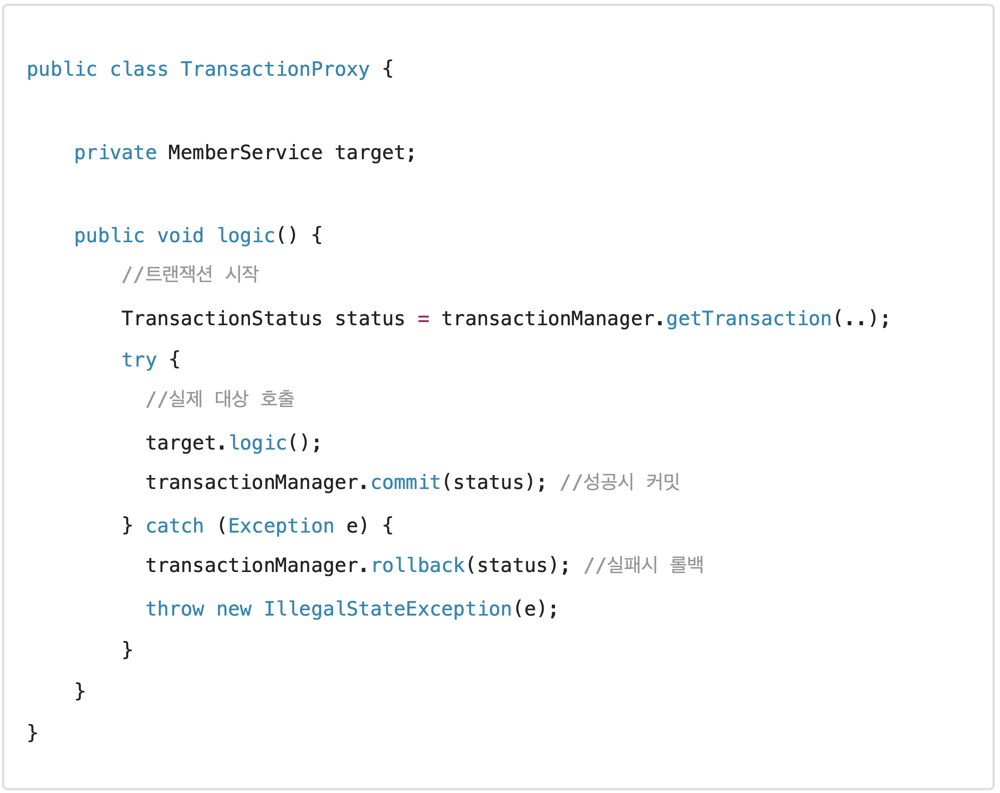

# 스프링 트랜잭션 이해

## 스프링 트랜잭션 소개

해당 절에서는 스프링 트랜잭션을 더 깊이있게 학습하고, 또 스프링 트랜잭션이 제공하는 다양한 기능들을 자세히 알아본다

먼저 본격적인 기능 설명에 앞서 지금까지 학습한 스프링 트랜잭션을 간략히 복습하면서 정리해보자.

### 스프링 트랜잭션 추상화

각각의 데이터 접근 기술들은 트랜잭션을 처리하는 방식에 차이가 있다. 예를 들어 JDBC 기술과 JPA 기술은 트랜잭션을 사용하는 코드 자체가 다르다

#### JDBC 트랜잭션 코드 예시

```java
public void accountTransfer(String fromId, String toId, int money) throws SQLException {
  Connection con = dataSource.getConnection();
  try {
    con.setAutoCommit(false); //트랜잭션 시작 //비즈니스 로직
    bizLogic(con, fromId, toId, money);
    con.commit(); //성공시 커밋 
  } catch (Exception e) {
    con.rollback(); //실패시 롤백
    throw new IllegalStateException(e);
  } finally {
    release(con);
  }
}
```

#### JPA 트랜잭션 코드 예시

```java
public static void main(String[] args) {
  //엔티티 매니저 팩토리 생성
  EntityManagerFactory emf = Persistence.createEntityManagerFactory("jpabook");
  EntityManager em = emf.createEntityManager(); //엔티티 매니저 생성 
  EntityTransaction tx = em.getTransaction(); //트랜잭션 기능 획득
  
  try {
    tx.begin();  //트랜잭션 시작 
    logic(em);   //비즈니스 로직 
    tx.commit(); //트랜잭션 커밋
  } catch (Exception e) { 
    tx.rollback(); //트랜잭션 롤백
  } finally {
    em.close(); //엔티티 매니저 종료
  }
  emf.close(); //엔티티 매니저 팩토리 종료
}
```

따라서 JDBC 기술을 사용하다가 JPA 기술로 변경하게 되면 트랜잭션을 사용하는 코드도 모두 함께 변경해야 한다.

스프링은 이런 문제를 해결하기 위해 트랜잭션 추상화를 제공한다. <mark style="color:blue;">**트랜잭션을 사용하는 입장에서는 스프링 트랜잭션 추상화를 통해 둘을 동일한 방식으로 사용할 수 있게 되는 것이다.**</mark>

스프링은 <mark style="color:blue;">`PlatformTransactionManager`</mark>라는 인터페이스를 통해 트랜잭션을 추상화한다.

#### PlatformTransactionManager 인터페이스

```java
package org.springframework.transaction;

public interface PlatformTransactionManager extends TransactionManager {
  TransactionStatus getTransaction(@Nullable TransactionDefinition definition) throws TransactionException;
  
  void commit(TransactionStatus status) throws TransactionException;
  void rollback(TransactionStatus status) throws TransactionException;
}
```

* 트랜잭션은 트랜잭션 시작(획득), 커밋, 롤백으로 단순하게 추상화할 수 있다.

.png>)

* <mark style="color:blue;">**스링은 트랜잭션을 추상화해서 제공할 뿐만 아니라**</mark>, 실무에서 주로 사용하는 데이터 접근 기술에 대한 <mark style="color:blue;">**트랜잭션 매니저의 구현체도 제공**</mark>한다.&#x20;
* 여기에 더해서 스프링 부트는 어떤 데이터 접근 기술을 사용하는지 자동으로 인식해서 적절한 트랜잭션 매니저를 선택해서 스프링 빈으로 등록해주기 때문에 트랜잭션 매니저를 선택하고 등록하는 과정도 생략할 수 있다.\
  예를 들어, <mark style="color:blue;">`JdbcTemplate`</mark>, <mark style="color:blue;">`MyBatis`</mark>를 사용하면 <mark style="color:blue;">`DataSourceTransactionManager`</mark>를 스프린으로 등록하고, <mark style="color:blue;">`JPA`</mark>를 사용하면 <mark style="color:blue;">`JpaTransactionManager`</mark>를 스프링 빈으로 등록해준다.


스프링 5.3 부터는 JDBC 트랜잭션을 관리할 때 <mark style="color:blue;">`DataSourceTransactionManager`</mark>를 상속받아서 약간의 기능을 확장한 <mark style="color:blue;">`JdbcTransactionManager`</mark>를 제공한다. 둘의 기능 차이는 크지 않으므로 같은 것으로 이해하면 된다.


### 스프링 트랜잭션 사용 방식

<mark style="color:blue;">`PlatformTransactionManager`</mark>를 사용하는 방법은 크게 2가지가 있다.

#### 선언적 트랜잭션 vs 프로그래밍 방식 트랜잭션 관리

* <mark style="color:blue;">**선언적 트랜잭션 관리(Declarative Transaction Management)**</mark>
  * <mark style="color:blue;">`@Transactional`</mark> 애노테이션 하나만 선언해서 매우 편리하게 트랜잭션을 적용하는 것은 선언적 트랜잭션 관리라 한다.
  * 선언적 트랜잭션 관리는 과거 XML에 설정하기도 했다.
  * 이름 그대로 해당 로직에 트랜잭션을 적용하겠다 라고 어딘가에 선언하기만 하면 트랜잭션이 적용되는 방식이다.
* <mark style="color:blue;">**프로그래밍 방식의 트랜잭션 관리(Programmatic Transaction Management)**</mark>
  * 트잭션 매니저 또는 트랜잭션 템플릿 등을 사용해서 트랜잭션 관련 코드를 직접 작성하는 것을 프로그래밍 방식의 트랜잭션 관리라 한다.


* **프로그래밍 방식의 트랜잭션 관리를 사용하게 되면, 애플리케이션 코드가 트랜잭션이라는 기술 코드와 강하게 결합된다.**
* 선언적 트랜잭션 관리가 프로그래밍 방식에 비해서 훨씬 간결하고 실용적이기 때문에 <mark style="color:blue;">**실무에서는 대부분 선언적 트랜잭션 관리를 사용한다**</mark>

### 선언적 트랜잭션과 AOP

<mark style="color:blue;">`@Transactional`</mark>을 통한 선언적 트랜잭션 관리 방식을 사용하게 되면 기적으로 프록시 방식의 AOP가 적용된다.&#x20;

#### 프록시 도입 전

 (1).png>)

트랜잭션을 처리하기 위한 프록시를 도입하기 전에는 서비스의 로직에서 트랜잭션을 직접 시작했다.

#### 서비스 계층의 트랜잭션 사용 코드 예

.png>)

#### 프록시 도입 후

.png>)

트랜잭션을 처리하기 위한 **프록시를 적용하면 트랜잭션을 처리하는 객체와 비즈니스 로직을 처리하는 서비스 객체를 명확하게 분리할 수 있다.**

#### 트랜잭션 프록시 코드 예시



#### 트랜잭션 프록시 적용 후 서비스 코드 예시

.png>)

* 프록시 도입 전: 서비스에 비즈니스 로직과 트랜잭션 처리 로직이 함께 섞여있다.
* 프록시 도입 후: <mark style="color:blue;">**트랜잭션 프록시가 트랜잭션 처리 로직을 모두 가져간다. 그리고 트랜잭션을 시작한 후에 실제 서비스를 대신 호출한다.**</mark> 트랜잭션 프록시 덕분에 서비스 계층에는 순수한 비즈니스 로직만 남길 수 있다.

### 프록시 도입 후 전체 과정

 (1).png>)

* 트랜잭션은 커넥션에 <mark style="color:blue;">`con.setAutocommit(false)`</mark>를 지정하면서 시작한다.
* 같은 트랜잭션을 유지하려면 같은 데이터베이스 커넥션을 사용해야 한다.
* 이것을 위해 스프핑 내부에서는 <mark style="color:blue;">**트랜잭션 동기화 매니저**</mark>가 사용된다.
* <mark style="color:blue;">`JdbcTemplate`</mark>을 포함한 대부분의 데이터 접근 기술들 트랜잭션을 유지하기 위해 내부에서 트랜잭션 동기화 매니저를 통해 리소스(커넥션)을 동기화 한다.

### 스프링이 제공하는 트랜잭션 AOP

* 스프링의 트랜잭션은 매우 중요한 기능이고, 전세계 누구나 다 사용하는 기능이다. 스프링은 트랜잭션 AOP를 처리하기 위한 모든 기능을 제공한다. **스프링 부트를 사용하면 트랜잭션 AOP를 처리하기 위해 필요한 스프링 빈들도 자동으로 등록해준다.**
* 개발자는 트랜잭션 처리가 필요한 곳에 <mark style="color:blue;">`@Transactional`</mark> 애노테이션만 붙여주면 된다. 스프링의 트랜잭션 AOP는 이 애노테이션을 인식해서 트랜잭션을 처리하는 프록시를 적용해준다.

```java
org.springframework.transaction.annotation.Transactional
```

## 트랜잭션 적용 확인

<mark style="color:blue;">`@Transactional`</mark>을 통해 선언적 트랜잭션 방식을 사용하면 단순히 애노테이션 하나로 트랜잭션을 적용할 수 있다. **그런데 이 기능은 트랜잭션 관련 코드가 눈에 보이지 않고, AOP를 기반으로 동작하기 때문에, 실제 트랜잭션이 적용되고 있는지 아닌지를 확인하기가 어렵다.**

스프링 트랜잭션이 실제 적용되고 있는지 확인하는 방법을 알아보자.

#### TxApplyBasicTest



#### proxyCheck() - 실행

* <mark style="color:blue;">`AoPUtils.isAopProxy()`</mark>: 선언적 트랜잭션 방식에서 스프링 트랜잭션은 AOP를 기반으로 동작한다. @Transactional을 메서드나 클래스에 붙면 해당 객체는 트랜잭션 AOP 적용의 대상이 되고, 결과적으로 실제 객체 대신에 트랜잭션을 처리해주는 프록시 객체가 스프링 빈에 등록된다. <mark style="color:blue;">**그리고 주입을 받을 때도 실제 객체 대신에 프록시 객체가 주입된다**</mark>.
* 클래스 이름을 출력해보면 <mark style="color:blue;">`basicService$$EnhancerBySpringCGLIB...`</mark>라고 프록시 클래스의 이름이 출력되는 것을 확인할 수 있다.

#### proxyCheck() - 실행결과

.png>)

#### 스프링 컨테이너에 트랜잭션 프록시 등록

.png>)

* 프록시는 <mark style="color:blue;">`BasicService`</mark>를 상속해서 만들어지기 때문에 다형성을 활용할 수 있다. 따라서 <mark style="color:blue;">`BasicService`</mark> 대신에 프록시인 <mark style="color:blue;">`BasicService$$CGLIB`</mark>를 주입할 수 있다.

#### 트랜잭션 프록시 동작 방식

.png>)

* 클라이언트가 주입 받은 <mark style="color:blue;">`basicService$$CGLIB`</mark>는 트랜잭션을 적용하는 프록시이다.

#### 테스트 코드 실행

실행하기 전에 먼저 다음 로그를 추가하자


```java
logging.level.org.springframework.transaction.interceptor=TRACE
```


이 로그를 추가하면 트랜잭션 프록시가 호출하는 트랜잭션의 시작과 종료를 명확하게 로그로 확인할 수 있다.


<mark style="color:blue;">`TransactionSynchronizationManager.isActualTransactionActive()`</mark>\
현재 스레드에 트랜잭션이 적용되어 있는지 확인할 수 있는 기능이다. 결과가 <mark style="color:blue;">`true`</mark>면 트랜잭션이 적용되어 있는 것이다. 트랜잭션의 적용 여부를 가장 확실하게 확인할 수 있다.


.png>)

* 로그를 통해 tx() 호출시에는 <mark style="color:blue;">`tx active=true`</mark>를 통해 트랜잭션이 적용된 것을 확인할 수 있다.
* <mark style="color:blue;">`TransactionInterceptor`</mark> 로그를 통해 트랜잭션 프록시가 트랜잭션을 시작하고 완료한 내용을 확인할 수 있다.
* <mark style="color:blue;">`noxTx()`</mark> 호출시에는 <mark style="color:blue;">`tx active=false`</mark>를 통해 트랜잭션이 없는 것을 확할 수 있다.

## 트랜잭션 적용 위치

> 생략...

## 트랜잭션 AOP 주의 사항 - 프록시 내부 호출


<mark style="color:blue;">`@Transactional`</mark>을 사용하면 스프링의 트랜잭션 AOP가 적용된다. 트랜잭션 AOP는 기본적으로 프록시 방식의 AOP를 사용한다. 앞서 배운 것 처럼 <mark style="color:blue;">`@Transactional`</mark>을 적용하면 프록시 객체가 요청을 먼저 받아서 트랜잭션을 처리하고, 실제 객체를 호출해준다. <mark style="color:blue;">**따라서 트랜잭션을 적용하려면 항상 프록시를 통해서 대상 객체(Target)을 호출해야 한다.**</mark> 이렇게 해야 프록시에 먼저 트랜잭션을 적용하고, 이후에 대상 객체를 호출하게 된다.

 (1).png>)

AOP를 적용하면 스프링은 대상 객체 대신에 프록시를 스프링 빈으로 등록한다. 따라서 스프링은 의존관계 주입시에 항상 실제 객체 대신에 프록시 객체를 주입한다. 프록시 객체가 주입되기 때문에 대상 객체를 직접 호출하는 문제는 일반적으로 발생하지 않는다. <mark style="color:blue;">**하지만 대상 객체의 내부에서 메서드 호출이 발생하면 프록시를 거치지 않고 대상 객체를 직접 호출하는 문제가 발생한다. 이렇게 되면**</mark><mark style="color:blue;">** **</mark><mark style="color:blue;">**`@Transactional`**</mark><mark style="color:blue;">**이 있어도 트랜잭션이 적용되지 않는다.**</mark> 실무에서 반드시 한번은 만나서 고생하는 문제이기 때문에 꼭 이해하고 넘어가자.

예제를 통해서 내부 호출이 발생할 때 어떤 문제가 발생하는지 알아보자. 먼저 내부 호출이 발생하는 예제를 만들어보자.



### internalCall() - 실행 결과

.png>)

 (1).png>)

### externalCall() - 실행 결과

.png>)

.png>)

### 프록시 방식의 AOP 한계

<mark style="color:blue;">`@Transactional`</mark> 를 사용하는 트랜잭션 AOP는 프록시를 사용한다. 프록시를 사용하면 메서드 내부 호출에 프록시를 적용할 수 없다.

그렇다면 이 문제를 어떻게 해결할 수 있을까?\
가장 단순한 방법은 내부 호출을 피하기 위해 <mark style="color:blue;">`internal()`</mark> 메서드를 별도의 클래스로 분리하는 것이다.

## 트랜잭션 AOP 주의사항 - 초기화 시점

스프링 초기화 시점에는 트랜잭션 AOP가 적용되지 않을 수 있다.



#### initV1() - @PostContruct

.png>)

가장 확실한 대안은 <mark style="color:blue;">`ApplicationReadyEvent`</mark> 이벤트를 사용하는 것이다.

#### initV2() - EventListener(value = ApplicationReadyEvent.class)

<mark style="color:blue;">`ApplicationReadyEvent`</mark> 이벤트는 트랜잭션 AOP를 포함한 스프링이 컨테이너가 완전히 생성되고 난 다음에 이벤트가 붙은 메서드를 호출해준다. 따라서 <mark style="color:blue;">`init2()`</mark> 는 트랜잭션이 적용된 것을 확인할 수 있다.

.png>)

## 트랜잭션 옵션 소


