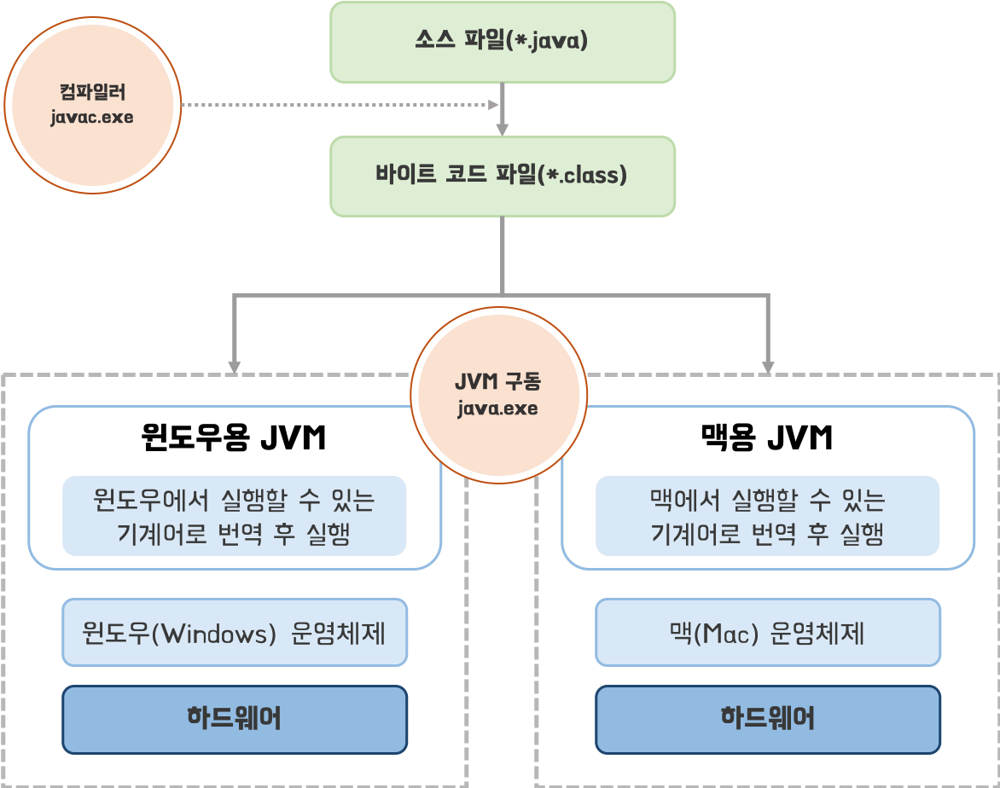

# Java

## 프로그래밍 언어란?

* <mark style="color:blue;">**프로그래밍 언어**</mark>는 사람과 컴퓨터가 대화하기 위해서 사용하며, 사람의 언어와 기계어의 다리 역할을 하는 언어
* 프로그래밍 언어는 <mark style="color:blue;">**고급 언어**</mark>와 <mark style="color:blue;">**저급 언어**</mark>로 구분
  * **고급 언어**
    * 컴퓨터와 대화할 수 있도록 만든 언어 중에서 사람이 쉽게 이해할 수 있는 언어
    * <mark style="color:blue;">**컴파일(compile)**</mark> 과정을 통해서 컴퓨터가 이해할 수 있는 0과 1로 이루어진 기계어로 변환 한 후, 컴퓨터가 사용
    * 일반적으로 프로그래밍 언어라고 하면 고급 언어를 가리킴
    * <mark style="color:blue;">**C**</mark><mark style="color:blue;">,</mark> <mark style="color:blue;"></mark><mark style="color:blue;">**C++**</mark><mark style="color:blue;">,</mark> <mark style="color:blue;"></mark><mark style="color:blue;">**Java**</mark>
  * **저급 언어**
    * 고급 언어와 반대로, 기계어에 가까운 언어
    * <mark style="color:blue;">**어셈블리어**</mark>
* 프로그래밍 언어과 관련된 개념
  * <mark style="color:blue;">**소스(source)**</mark>**:** 프로그래밍 언어로 작성된 문서
  * <mark style="color:blue;">**컴파일러(compiler)**</mark>**:** 사람이 작성한 소스를 기계어로 변환하는 소프트웨어
  * <mark style="color:blue;">**프로그램(program)**</mark>**:** 컴퓨터에서 특정 목적을 수행하기 위해 프로그래밍 언어로 작성된 소스를 기계어로 번역한 것

## 자바란?

***

### 자바 소개

* 1991년, 썬의 엔지니어들에 의해서 고안된 오크(Oak)라는 언어에서부터 시작됨
  * 참고로 오크는 가전제품에서 사용될 목적이었음
* 1995년, 썬 마이크로시스템즈에서 <mark style="color:blue;">**자바(Java)**</mark>를 처음 발표함
* 1999년, 인터넷이 활성화되면서 웹 애플리케이션 구축용 언어로 자바가 급부상
  * 한 번의 소스 작성으로 다양한 서버 운영 체제에서 실행 가능한 언어는 자바 뿐이었기 때문
  * 이전에는 윈도우(Windows) 프로그램이 주류였기 때문에 C++에 비해 자바는 열세였음

### 자바의 특징

#### <mark style="color:blue;">**이식성이 높은 언어이다**</mark>

* <mark style="color:blue;">**이식성**</mark>**:** 서로 다른 실행 환경을 가진 시스템 간에 프로그램을 옮겨 실행할 수 있는 것
  * 윈도우 운영체제에서 실행하는 프로그램을 리눅스 또는 유닉스에서 실행할 수 있다면 이식성이 높은 것
  * 반대로 실행할 수 없다면 이식성이 낮은 것
* 자바로 개발된 프로그램은 소스 파일을 수정하지 않아도, <mark style="color:blue;">**자바 실행 환경(Java Runtime Environment, JRE)**</mark>이 설치 되어 있는 모든 운영체제에서 실행 가능

#### <mark style="color:blue;">**객체 지향 언어이다**</mark>

* <mark style="color:blue;">**객체 지향 프로그래밍(Object Oriented Programming, OOP)**</mark>: 부품에 해당하는 객체들을 먼저 만들고, 이것들을 하나씩 조립 및 연결해서 전체 프로그램을 완성하는 <mark style="color:blue;">**프로그램 개발 기법**</mark>
* 자바는 객체를 만들기 위한 개념도인 <mark style="color:blue;">**클래스**</mark>를 작성해야하고, 객체와 객체를 연결하여 프로그램을 만듦
* 객체 지향 언어가 가져야할 <mark style="color:blue;">**캡슐화**</mark><mark style="color:blue;">,</mark> <mark style="color:blue;"></mark><mark style="color:blue;">**상속**</mark><mark style="color:blue;">,</mark> <mark style="color:blue;"></mark><mark style="color:blue;">**다형성**</mark> 기능을 완벽하게 지원

#### <mark style="color:blue;">함수적 스타일 코딩을 지원한다</mark>

* 최근 들어 함수적 프로그래밍이 부각됨
  * 대용량 데이터의 병렬 처리, 이벤트 지향 프로그래밍에 적합하기 때문
* 자바는 함수적 프로그래밍을 위해 <mark style="color:blue;">**람다식(Lambda Expressions)**</mark>을 자바 8부터 지원

#### <mark style="color:blue;">**메모리를 자동으로 관리한다**</mark>

* 자바는 개발자가 직접 메모리에 접근할 수 없도록 설계됨
* <mark style="color:blue;">**메모리는 자바가 직접관리**</mark>
  * 객체 생성 시, 자동으로 힙 영역에 메모리 공간을 할당
  * 사용이 완료되면 <mark style="color:blue;">**쓰레기 수집기(Garbage Collector)**</mark>를 이용해 자동으로 객체를 제거

#### <mark style="color:blue;">**다양한 애플리케이션을 개발할 수 있다**</mark>

* 자바는 다양한 운영체제에서 실행되는 프로그램을 개발할 수 있음
* 다양한 운영체제에서 사용할 수 있는 개발 도구와 API를 묶어 <mark style="color:blue;">**에디션(Edition)**</mark> 형태로 정의
* <mark style="color:blue;">**Java SE(Standard Edition)**</mark>
  * Java SE는 자바 프로그램들이 공통적으로 사용하는 <mark style="color:blue;">**자바 가상 기계(Java Virtual Machine, JVM)**</mark>를 비롯하여 개발에 필수적인 도구와 라이브러리 API를 정의
  * 자바 프로그램을 개발하고 실행하기 위해서는 반드시 Java SE 구현체인 <mark style="color:blue;">**자바 개발 키트(Java Development Kit, JDK)**</mark>를 설치해야함
* <mark style="color:blue;">**Java EE(Enterprise Edition)**</mark>
  * Java EE는 서버용 애플리케이션을 개발하기 위한 도구 및 라이브러리 API를 정의
  * Servlet API 표준을 만족하는 [Jakarta Servlet(](https://en.wikipedia.org/wiki/Jakarta\_Servlet)일반적으로 Java Servlet) 포함

#### <mark style="color:blue;">**멀티 스레드(Multi-Thread)를 쉽게 구현할 수 있다**</mark>

* 운영체제에 따라 멀티 스레드를 구현하는 방법이 다름
* 자바는 스레드와 관련된 라이브러리 API를 제공
* API를 이용해 운영체제에 상관없이 멀티 스레드를 쉽게 구현할 수 있음

#### <mark style="color:blue;">동적 로딩(Dynamic Loading)을 지원한다</mark>

* 응이 실행될 때 모든 객체가 생성되지 않고, **객체가 필요한 시점에 클래스를 동적으로 로딩해서 객체를 생성**
* 개발 완료 후 소스를 수정하더라도 해당 클래스만 수정하면 되므로 전체 애플리케이션을 다시 컴파일 할 필요가 없음

## 자바 가상 기계(JVM)

* 일반적인 운영체제에서 자바 프로그램을 바로 실행할 수 없음
  * 자바 프로그램이 완전한 기계어가 아닌, 중간 단계의 바이트 코드이기 때문
* <mark style="color:blue;">**자바 가상 기계(Java Virtual Machine, JVM)**</mark>는 자바 프로그램을 실행하는 가상의 운영체제
  * 따라서 개발자는 운영체제와 상관없이 자바 프로그램을 개발할 수 있음
* JDK 또는 JRE를 설치하면 JVM은 자동으로 설치됨
  * JDK와 JRE는 운영체제에 맞게 설치해야함
* JVM은 운영체제에 종속적

## 자바 개발 환경 구축

### 자바 개발 도구(JDK)

* **Java SE 구현체**
  * **자바 개발 키드(JDK: Java Development Kit)**
    * JVM
    * 라이브러리 API
    * 컴파일러
    * 이외의 개발 도구
  * **자바 실행 환경(JRE: Java Runtime Environment)**
    * JVM
    * 라이브러리 API
* 이미 개발된 프로그램만 실행하고자 한다면 **JRE**만 설치하면 됨
