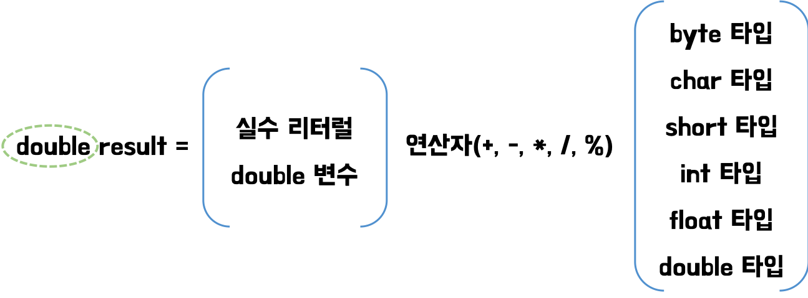

# Variable And Type

## 1. 변수

* <mark style="color:blue;">**변수(Variable)**</mark>**:** 하나의 값을 저장할 수 있는 메모리 공간
* 변수에는 한 가지 타입의 값만 저장할 수 있음
* <mark style="color:blue;">**변수 선언**</mark>은 어떤 타입의 데이터를 저장할 것인지, 변수 이름이 무엇인지 결정
*   같은 타입의 변수는 콤마(,)를 이용해서 한꺼번에 선언할 수 도 있음

    ```java
    int x, y, z;
    ```


*   변수 이름은 자바 언어에서 정한 <mark style="color:blue;">**명명 규칙(naming convention)**</mark>을 따라야함

    | 작성 규칙                                             | 예                                                       |
    | ------------------------------------------------- | ------------------------------------------------------- |
    | 첫 번째 글자는 문자이거나 ‘$’, ’\_’ 이어야 하고 숫자로 시작할 수 없다.(필수) | 가능: price, $price, \_companyName안됨: 1v, @speed, $#value |
    | 문자 수(길이)의 제한은 없다.                                 |                                                         |
    | 자바 예약어는 사용할 수 없다.(필수)                             |                                                         |
    | ….(생략)                                            |                                                         |


* 변수에 값을 저장할 때에는 <mark style="color:blue;">**대입 연산자(=)**</mark>를 사용
* <mark style="color:blue;">**초기값**</mark>**:** 변수의 선언 후, 처음으로 저장하는 값
* <mark style="color:blue;">**초기화**</mark>**:** 변수에 초기값을 할당하는 행위
* 변수는 선언된 {} 블록 내에서만 유효함
  * Ex) 메소드 내에 선언된 변수는 메소드의 실행이 끝나면 메모리에서 자동으로 없어짐

****

* <mark style="color:blue;">**리터럴(literal)**</mark>**:** 상수값
  * 상수(constant)는 프로그래밍에서는 다른 의미로 정의하기 때문에 리터럴이라고 표현

> <mark style="color:blue;">**리터럴의 종류**</mark>



```java
// 저장 가능 데이터 타입: byte, char, short, int, long

0, 75, -100				// 10진수
02, -04					// 8진수
0x5, 0xA, 0xB3, 0xAC08	// 16진수
```



```java
// 저장 가능 데이터 타입: float, double

0.25, -3.14
5E7			//5 * 10^7
0.12e-5		//0.12 * 10^-5
```



```java
// 저장 가능 데이터 타입: char

'A', '한', '\\t', '\\n'
```



```java
// 저장 가능 데이터 타입: String

"대한민국", "탭 만큼 이동 \\t 합니다.", "한줄 내려 쓰기 \\n 합니다."
```



```java
// 저장 가능 데이터 타입: boolean

true, false
```



## 2. 기본 타입

* <mark style="color:blue;">**기본 타입(primitive type)**</mark>**:** 정수, 실수, 문자, 논리 리터럴을 <mark style="color:blue;">**직접 저장**</mark>하는 타입
* <mark style="color:blue;">**쓰레기값**</mark>**:** 값의 범위를 초과해서 저장된 값
  * 잘못된 연산을 한 경우, 저장될 수 있음
* <mark style="color:blue;">**값의 범위를 넘어선 초기값**</mark>은 변수에 저장되기 전에 컴파일러가 체크해줌
* 기본 타입의 종류: <mark style="color:blue;">**정수 타입**</mark><mark style="color:blue;">,</mark> <mark style="color:blue;"></mark><mark style="color:blue;">**실수 타입**</mark><mark style="color:blue;">,</mark> <mark style="color:blue;"></mark><mark style="color:blue;">**논리 타입**</mark>

### 2-1. 정수 타입

| 정수 타입 | byte | char | short | int | long |
| ----- | ---- | ---- | ----- | --- | ---- |
| 바이트 수 | 1    | 2    | 2     | 4   | 8    |



* \-2^7 \~ 2^7 - 1
* 이진(바이너리) 데이터를 처리할 때 주로 사용됨



* 0 \~ 2^{16} - 1
* 자바는 모든 문자를 **유니코드**로 처리
* **유니코드(Unicode):** 세계 각국의 문자들을 코드값으로 매핑한 국제 표준 규약
  * 2 byte 크기를 가진 정수값
  * 0 \~ 65535
* char 타입에는 음수를 저장할 수 없음
* 작음 따옴표(’)로 감싼 문자를 대입하면 해당 문자의 유니코드가 저장됨



* \-2^{15} \~ 2^{15}-1
* C언어와의 호환을 위해 사용됨



* \-2^{31} \~ 2^{31}-1
* **자바에서 정수 연산을 하기 위한 기본 타입**
  * Ex) byte 또는 short 타입의 변수를 사칙 연산하면 int 타입으로 변환된 후 연산됨
* **정수 리터럴의 기본 타입**



* \-2^{63} \~ 2^{63}-1
* 수치가 큰 데이터를 다룰때 사용됨
*   long 타입의 변수를 초기화할 때는 정수 리터럴 뒤에 **`L`** 을 붙여 사용

    ```java
    long longValue = 100000000L;
    ```



### 2-2. 실수 타입

| 실수 타입 | float | double |
| ----- | ----- | ------ |
| 바이트 수 | 4     | 8      |



* 부호(1 bit) + 지수(8 bit) + 가수(23 bit) => 32bit
*   float 타입의 변수를 초기화할 때는 실수 리터럴 뒤에 \*\*`F`\*\*를 붙여 사용

    ```java
    float floatValue1 = 0.002F;
    float floatValue2 = 0.2e-3F;
    ```



* 부호(1 bit) + 지수(11 bit) + 가수(52 bit) => 64bit
* <mark style="color:blue;">**실수 리터럴의 기본 타입**</mark>
* <mark style="color:blue;">**float 보다 더 정밀한 값을 저장하기 위해 사용**</mark>
  * 두 배 이상 정밀하게 값을 표현할 수 있음
  * 가수 비트의 수가 두 배 이상 크기 때문



### 2-3. 논리 타입

#### **boolean 타입**

* <mark style="color:blue;">**논리값(true/false)**</mark>을 저장하는 데이터 타입

## 3. 타입 변환

* <mark style="color:blue;">**타입 변환**</mark>**:** 데이터 타입을 다른 데이터 타입으로 변환하는 것
  * <mark style="color:blue;">**자동 타입 변환(Promotion)**</mark>
  * <mark style="color:blue;">**강제 타입 변환(Casting)**</mark>

### 3-1. 자동 타입 변환

* <mark style="color:blue;">**프로그램 실행 도중에 자동적으로 타입 변환이 일어나는 것**</mark>
* 작은 크기를 가지는 타입이 큰 크기를 가지는 타입에 저장될 때 발생
  * <mark style="color:blue;">**byte(1) < short(2) < int(4) < long(8) < float(4) < double(8)**</mark>
  * 예외) char charValue = byteValue\
    `char`는 음수를 표현하지 못하므로 자동 형변환이 일어나지 않음
* **변환 전의 값이 보존됨**

### 3-2. 강제 타입 변환

* 강제적으로 큰 데이터 타입을 작은 데이터 타입으로 쪼개어서 저장하는 것
* 캐스팅 연산자 **`( )`** 사용
* <mark style="color:blue;">**실수 타입을 정수 타입으로 강제 타입 변환 하는 경우, 소수점 이하 부분은 버려짐**</mark>
* 변환 전의 값이 보존되지 않음
  * <mark style="color:blue;">**단, 변환 전의 값이 변환 후의 데이터 타입이 표현할 수 있는 범위 내의 값이라면 보존됨**</mark>
  * 변환 후의 데이터 타입의 최소값과 최대값을 벗어나는지 <mark style="color:blue;">**반드시**</mark> 검사해야함

| 기본 타입 | 최대값 상수           | 최솟값 상수           |
| ----- | ---------------- | ---------------- |
| byte  | Byte.MAX\_VALUE  | Byte.MIN\_VALUE  |
| short | Short.MAX\_VALUE | Short.MIN\_VALUE |
| int   | Int.MAX\_VALUE   | Int.MIN\_VALUE   |
| ...   | ...              | ...              |


*   정수 타입을 실수 타입으로 변환할 때 <mark style="color:blue;">**정밀도 손실**</mark>을 주의해야함

    ```java
    int num1 = 123456780;
    int num2 = 123456780;
    float num3 = num2;
    num2 = (int) num3;
    System.out.println(num1 - num2); // 정밀도 손실이 일어남
    // 결과 -4
    ```
* 정수 값을 손실없이 float 타입의 값으로 변환하려면 가수 23비트로 표현 가능한 값이어야 함
* <mark style="color:blue;">**int 값을 실수 타입으로 안전하게 변환하기 위해서는 double 타입을 사용해야함**</mark>
  * int의 크기(32 bit)보다 double의 가수비트(52 bit)가 더 크기 때문

### 3-3. 연산식에서의 자동 타입 변환

* 서로 다른 타입의 피연산자가 있을 경우, 크기가 큰 타입으로 자동 변환된 후 연산을 수행
  * <mark style="color:blue;">**byte(1) < short(2) < int(4) < long(8) < float(4) < double(8)**</mark>
* 자바는 정수 연산의 경우 int 타입을 기본으로 함
  * 4byte 보다 작은 타입(byte, char, short)은 4byte인 int 타입으로 변환된 후 연산이 수행



