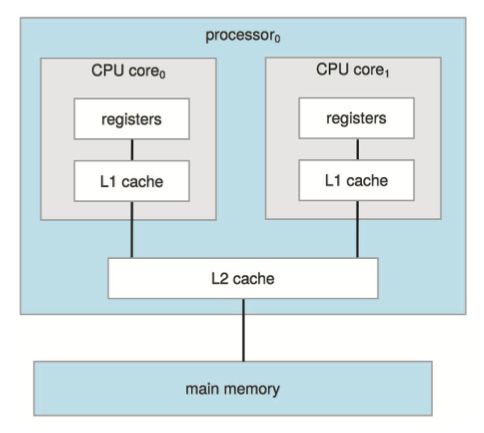

# Introduction

## 1. 컴퓨터 시스템 구조\_Computer System Architecture

컴퓨터 시스템은 사용된 범용 처리기의 수에 따라 다양한 방식으로 구성될 수 있음


CPU: 명령을 실행하는 하드웨어&#x20;

프로세서(processor): 하나 이상의 CPU를 포함하는 물리적인 칩&#x20;

코어(core): CPU의 기본 계산 단위&#x20;

멀티 코어(multicore): 동일한 CPU에 여러 컴퓨팅 코어를 포함함&#x20;

멀티 프로세서(multiprocessor): 여러 프로세서를 포함함


### 1-1. 싱글 프로세서 시스템\_Single-Processor Systems

* 수년 전, 대부분의 컴퓨터 시스템은 싱글 처리 코어(processing core)를 가진 하나의 CPU를 포함하는 단일 프로세서를 사용함
* <mark style="color:red;">코어(core)</mark>는 명령을 실행하고, 로컬로 데이터를 저장하기 위해 레지스터를 포함하는 컴포넌트임
* 코어를 가진 하나의 메인 CPU는 프로세스의 명령어를 포함하여 범용 명령어 세트를 실행할 수 있음

* 디스크, 키보드 및 그래픽 컨트롤러와 같은 장치를 위한 특수 목적의 프로세서(special-purpose precessor)도 있음
* 이러한 프로세서들은 제한된 명령어 집합을 실행하고 사용자 프로세스를 실행하지 않음

* 일반적으로 CPU와 특수 목적의 프로세스는 함께 사용되지만, 이를 멀티 프로세서 시스템이라 정의하지는 않음
* 싱글 처리 코어를 가진 범용 CPU가 하나만 있는 경우, 이 시스템을 싱글 프로세서 시스템이라고 정의함
* 그러나 이 정의에 따르면, 현대에 컴퓨터 시스템이 싱글 프로세서 시스템인 경우는 거의 없음

### 1-2. 멀티 프로세서 시스템\_Multiprocessor Systems

* 모바일 장치에서 서버에 이르기까지 최신 컴퓨터에서는 <mark style="color:red;">멀티 프로세서 시스템(multiprocessor systems)</mark>이 컴퓨팅 환경을 지배하고 있음
* 일반적으로 이와 같은 시스템에서는 싱글 코어 CPU가 포함된 여러 프로세서로 구성됨
* 프로세서는 컴퓨터 버스 및 때때로 클록, 메모리 및 주변 장치를 공유함

* <mark style="color:blue;">멀티 프로세서 시스템의 주요 장점은 처리량 증가임</mark>
* 즉, 프로세서 수를 늘리면 더 적은 시간에 더 많은 작업을 수행할 수 있음
* <mark style="color:blue;">그러나 N 프로세서의 속도 향상 비율은 N이 아님</mark>
* 여러 프로세서가 하나의 작업에 협력할 때 모든 프로세서가 올바르게 작동하게 유지하는 데 어느 정도의 오버헤드가 발생함

#### SMP

* 가장 일반적인 멀티 프로세서 시스템은 각 CPU 프로세서가 운영체제의 기능과 사용자 프로세스를 모두 포함하여 연산하는 <mark style="color:red;">SMP(symmetric multiprocessing)</mark>을 사용함
* 아래의 그림은 각각 자체 CPU를 가지는 두 개의 프로세서가 있는 일반적인 SMP 구조를 보여줌
* 각 CPU 처리기는 개별 또는 로컬 캐시뿐만 아니라 자체 레지스터를 포함함
* 그러나 모든 프로세서는 시스템 버스를 통해 물리 메모리를 공유함

* 이 모델의 장점은 많은 프로세스를 동시에 실행할 수 있다는 것임
* 하지만 CPU가 독립적이기 때문에 하나는 유휴 상태이고 다른 하나는 과부화가 걸려 비효율적일 수 있음

#### Multicore

* **멀티 프로세서**의 정의는 시간이 지남에 따라 발전해 왔으며, 이제는 여러 개의 컴퓨팅 코어가 단일 칩에 상주하는 <mark style="color:red;">멀티 코어(multicore)</mark> 시스템을 포함함
* <mark style="color:blue;">칩 내 통신이 칩 간 통신보다 빠르므로 다중 코어 시스템은 단일 코어를 가지는 여러 칩보다 효율적일 수 있음</mark>

<mark style="color:blue;">****</mark>

* 아래의 그림은 같은 프로세서 칩에 두 개의 코어를 가지는 이중 코어 설계를 보여줌
* 이 설계에서 각 코어에는 자체 레지스터와 레벨 1 (L1) 캐시라고도 불리는 자체 로컬 캐시가 있음
* 또한 칩에 국한되지만 두 코어에서 공유하는 레벨 2 (L2) 캐시도 존재함
* 대부분의 아키텍처는 이러한 방식을 채택함

### 1-3. 클러스터형 시스템\_Clustered Systems

* 여러 CPU를 가진 시스템의 또 다른 유형은 <mark style="color:red;">클러스터형 시스템</mark>임
* 클러스터 시스템은 둘 이상의 독자적 시스템 또는 노드들을 연결한다는 점에서 멀티 프로세스 시스템과 차이가 있음
  * 각 노드는 보통 멀티 코어 시스템임
* 이러한 시스템은 <mark style="color:red;">약한 결합(loosely coupled)</mark>이라고 간주됨
* 클러스터형(clustered)의 정의는 분명하지 않지만, 일반적인 정의에 의하면 클러스터 컴퓨터는 저장장치를 공유하고 LAN이나 infiniBand와 같은 고속의 상호 연결망으로 연결됨

* 클러스터링은 보통 <mark style="color:red;">높은 가용성(availability)</mark>를 제공하기 위해 사용됨
* 즉, 클러스터 내 하나 이상의 컴퓨터 시스템이 고장 나더라도 서비스는 계속 이어짐
* 높은 가용성은 안정성 향상을 위해 여러 응용에서 중요함
* 고장나지 않은 하드웨어 수준에 비례하여 서비스를 계속 제공하는 능력을 <mark style="color:red;">우아한 성능 저하(graceful degradation)</mark>이라고 표현함

* 클러스터링은 비대칭적으로 또는 대칭적으로 구성될 수 있음
* <mark style="color:red;">비대칭형 클러스터링(asymmetric clustering)</mark>에서는 다른 컴퓨터들이 애플리케이션을 실행하는 동안 한 켬퓨터는 긴급대기(hot-standby) 모드 상태를 유지함
* 이 긴급 대기 모드의 호스트는 활성 서버들을 감시하다가, 서버가 고장나면 활성 서버가 됨
* <mark style="color:red;">대칭형 클러스터링(symmetric clustering)</mark>에서는 둘 이상의 호스트들이 애플리케이션을 각자 실행하면서 서로를 감시함
* <mark style="color:blue;">가용한 하드웨어를 모두 사용하기 때문에 대칭형 구성이 더 효율적임</mark>

<mark style="color:blue;"></mark>

Continue....
