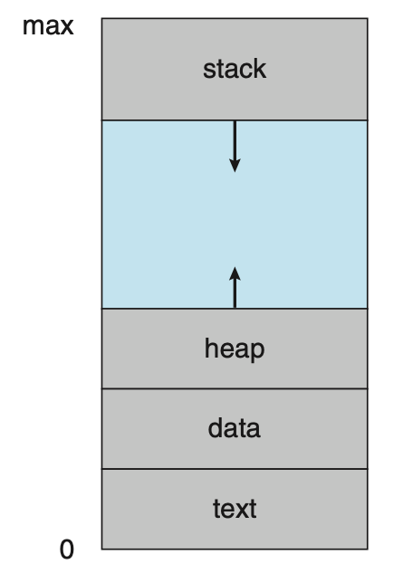
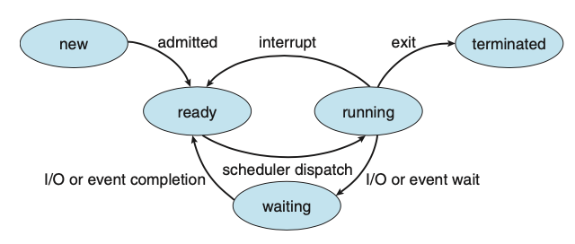
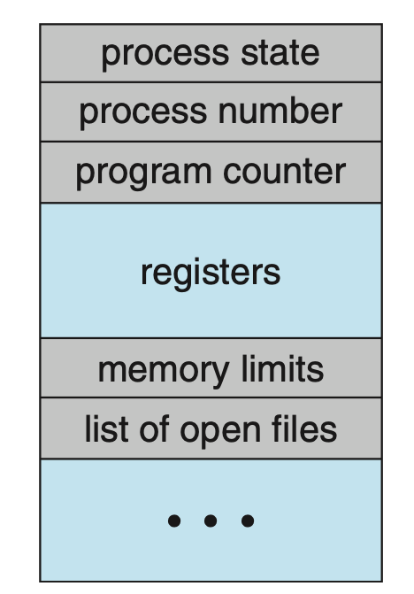

# Process

* <mark style="color:red;">프로세스(process)</mark>란 실행 중인 프로그램을 말함
* 모든 프로세스는 잠재적으로 병행 실행이 가능하고, CPU(또는 CPU들)는 이들 프로세스 가운데서 다중화(multiplex)됨

## 3.1 프로세스 개념\_Process Concept

* 비공식적으로 실행 중인 프로그램은 프로세스라고 불림
* 프로세스의 현재 활동 상태는 <mark style="color:red;">프로그램 카운터(program counter)</mark>의 값과 프로세서 레지스터의 내용으로 나타냄
* 프로세스의 메모리 배치는 보통 여러 섹션으로 구분됨
  * <mark style="color:red;">텍스트 섹션(Text section)</mark>: 실행 코드
  * <mark style="color:red;">데이터 섹션(Data section)</mark>: 전역 변수
  * <mark style="color:red;">힙 섹션(Heap section)</mark>: 프로그램 실행 중에 동적으로 할당되는 메모리
  * <mark style="color:red;">스택 섹션(Stack section)</mark>: 함수를 호출할 때 임시 데이터 저장장소(예: 함수 매개변수, 복귀주소 및 지역변수)

* 텍스트 및 데이터 섹션의 크기는 고정되기 때문에 프로그램 실행 시간 동안 크기가 변하지 않음
* 그러나 스택 및 힙 섹션은 프로그램 실행 중에 동적으로 줄어들거나 커질 수 있음
* 함수가 호출 될 때마다 함수 매개변수, 지역 변수 및 복귀 주소를 포함하는 <mark style="color:red;">활성화 레코드(actionvation record)</mark>가 스택에 푸쉬됨
* 마찬가지로 메모리가 동적으로 할당됨에 따라 힙 섹션이 커지고 메모리가 반환되면 작아짐
* 운영체제는 스택과 힙 섹션이 서로의 **방향으로** 커지더라도 **겹치지** 않도록 보장해야함

* 프로그램은 명령어 리스트를 담고 있는 파일(<mark style="color:red;">실행 파일</mark>)이며, 디스크에 저장됨
  * **수동적인 존재(passive entity)**
* 프로세스는 다음에 실행할 명령어를 지정하는 프로그램 카운터와 관련된 자원의 집합을 가짐
  * **능동적인 존재(active entity)**
* <mark style="color:blue;">실행 파일이 메모리에 적재될 때 프로그램은 프로세스가 됨</mark>

* <mark style="color:blue;">두 프로세스가 동일한 프로그램을 통해 실행될 수 있지만, 이들은 별도의 실행 시퀀스로 간주됨</mark>
* 이들은 별도의 프로세스이며, 텍스트 섹션이 동일하다 할지라도 데이터, 힙 및 스택 섹션은 다를 수 있음

* 프로세스가 실행되는 과정에서 다른 프로세스를 여럿 생성하는 것은 일반적임
* 프로세스 자체가 다른 개체를 위한 실행 환경으로 동작할 수 있다는 것 또한 중요한 사실임
  * 대표적인 예가 JVM임

### 3.1.2 프로세스 상태\_Process State

* 프로세스는 실행되는 과정에서 <mark style="color:red;">상태(state)</mark>가 변함:
  * <mark style="color:red;">새로운(new)</mark>: 프로세스가 생성 중인 상태
  * <mark style="color:red;">실행(running)</mark>: 명령어들이 실행되고 있는 상태
  * <mark style="color:red;">대기(waiting)</mark>: 프로레스가 어떤 이벤트(입축력 완료 또는 신호의 수신 같은)가 일어나기를 기다리는 상태
  * <mark style="color:red;">준비(ready)</mark>: 프로세스가 처리기에 할당되기를 기다리는 상태
  * <mark style="color:red;">종료(terminated)</mark>: 프로세스의 실행이 종료된 상태

* 상태의 이름은 운영체제 마다 다를 수 있지만, 각 상태들은 모든 시스템에서 찾아볼 수 있음
* 여기서 중요한 점은 ‘<mark style="color:blue;">한순간에 한 처리기 코어에서는 오직 하나의 프로세스만이 실행된다는 것</mark>’
* 이를 통해 알 수 있는 것은 ‘<mark style="color:blue;">많은 프로세스가 준비 혹은 대기 상태일 수 있다는 것</mark>’

### 3.1.3 프로세스 제어 블록\_Process Control Block

* 각 프로세스는 운영체제에서 <mark style="color:red;">프로세스 제어 블록(process control block, PCB)</mark>로 표현됨
  * <mark style="color:red;">테스크 제어 블록(task control block)</mark>이로고도 불림
* 즉, PCB는 프로세스를 시작시키거나 다시 시작시키는 데 필요한 모든 데이터를 위한 저장소의 역할을 함
* PCB는 아래와 같이 특정 프로세스와 연관된 여러 정보를 저장함
  * **프로세스 상태(Process state)**: 위에서 기술한 상태들을 저장함
  * **프로그램 카운터(Program counter)**: 프로그램 카운터는 이 프로세스가 다음에 실행할 명령어의 주소를 가리킴
  * **CPU 레지스터들(CPU registers)**: CPU 레지스터는 컴퓨터의 구조에 따라 다양한 수와 유형을 가짐. 레지스터에는 누산기(accumulator), 인덱스 레지스터, 스택 레지스터, 범용 레지스터들과 상태 코드(condition code) 정보가 포함됨. 프로그램 카운터와 함께 이 상태 정보는, 나중에 프로세스가 다시 스케줄 될 때 올바르게 실행되도록 하기 위해서 인터럽트 발생 시 저장되어야함
  * **CPU-스케줄링 정보(CPU-scheduling information)**: 이 정보는 프로세스 우선순위, 스케줄 큐에 대한 포인터와 다른 스케줄 매개변수를 포함함
  * **메모리 관리 정보(Memory-management information)**: 이 정보는 운영체제에 의해 사용되는 메모리 시스템에 따라 기준(base) 레지스터와 한계(limit) 레지스터의 값, 운영체제가 사용하는 메모리 시스템에 따라 페이지 테이블 또는 세그먼트 테이블 등과 같은 정보를 포함함
  * **회계 정보(Accounting information)**: 이 정보는 CPU 사용 시간과 경과된 실시간, 시간 제한, 계정 번호, 잡 또는 프로세스 번호 등을 포함함
  * **입출력 상태 정보(I/O status information)**: 이 정보는 이 프로세스에 할당된 입출력 장치들과 열린 파일의 목록 등을 포함함

### 3.1.4 스레드\_Threads

* 이제까지 논의한 프로세스 모델은 프로세스가 하나의 실행 <mark style="color:red;">스레드(thread)</mark>를 실행하는 프로그램임을 가정함
* 이 단일 제어 스레드는 프로세스가 한 번에 단지 한 가지의 일만 실행하도록 허용함
  * 따라서, 문자를 입력하면서 동시에 철자 검사기를 실행 할 수 없음
* 대부분의 현대 운영체제들은 한 프로세스가 다수의 실행 스레드를 가질 수 있도록 허용함으로써, 프로세스가 한 번에 하나 이상의 일을 수행할 수 있도록 허용함
* 이러한 특성은 [다중 처리기 시스템](https://app.gitbook.com/s/6s8PBLsFpflfD85fhlnn/\~/changes/qCbzJ6FuM3s7bFF1XGpb/os/concepts/undefined#1.3.2-\_multiprocessor-systems)에서 이익을 얻을 수 있는데, 여러 스레드가 병렬로 실행될 수 있음
* <mark style="color:blue;">스레드를 지원하는 시스템에서 PCB는 각 스레드에 관한 정보를 포함하도록 확장됨</mark>
