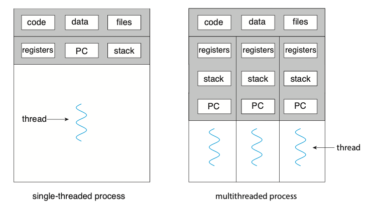

# Threads & Concurrency

## 1. 개요\_Overview

* 스레드는 CPU 이용의 기본 단위임
* <mark style="color:blue;">스레드는 스레드 ID, 프로그램 카운터(PC), 레지스터 집합 그리고 스택으로 구성됨</mark>
* <mark style="color:blue;">스레드는 같은 프로세스에 속한 다른 스레드와 코드, 데이터 섹션, 그리고 열린 파일이나 신호와 같은 운영체제 자원들을 공유함</mark>
* 전통적인 프로세스는 하나의 제어 스레드를 가지고 있음
* 만일 프로세스가 다수의 제어 스레드를 가진다면, 프로세스는 동시에 하나 이상의 작업을 수행할 수 있음
* 아래의 그림은 <mark style="color:red;">**싱글 스레드**</mark> 프로세스와 <mark style="color:red;">**멀티 스레드**</mark> 프로세스의 차이점을 보여주고 있음

### 1-1. 동기\_Motivation

* 현대의 컴퓨터와 모바일 기기에서 작동하는 거의 모든 소프트웨어 응용들은 멀티 스레드를 이용함
* 응용 프로그램은 통상 여러 제어 스레드가 있는 별도의 프로세스로 구현됨(?)
* 멀티 코어 시스템(multicore system)에서 CPU 집약적인 테스크를 병렬로 실행함으로써 응용의 처리 능력을 향상시킬 수 있음

* 하나의 응용 프로그램이 여러 개의 비슷한 작업을 수행해야 하는 상황이 있음
* 예를 들어, 하나의 웹 서버에 여러 개(아마도 수천 개)의 클라이언트들이 병행하게 접근할 수 있음
* 만약 웹 서버가 전통적인 단일 스레드 프로세스로 작동한다면 하나의 프로세스는 하나의 클라이언트만 서비스할 수 있게 되어, 다른 클라이언트는 매우 오랜시간을 기다려야함
* 서버에게 요청이 들어오면, 프로세스는 그 요청을 수행할 별도의 프로세스를 생성함으로써 위와 같은 문제를 해결할 수 있음

* 프로세스 생성 작업은 매우 많은 시간과 자원을 필요로함
* 새로운 프로세스가 해야할 일이 기존 프로세스가 하는 일과 동일하다면, 이러한 오버헤드를 감수할 필요가 없음
* 대부분 이러한 상황에서는 프로세스 안에 여러 스레드를 만들어 나가는 것이 더 효율적임
* 아래와 같이 웹 서버가 멀티 스레드화 되면, 서버는 클라이언트의 요청을 처리하는 별도의 스레드를 생성함

### 1-2. 장점\_Benefits



#### Responsiveness

* 대화형 응용(interactive application)을 <mark style="color:blue;">**멀티 스레드화하면 일부분이 블락되거나, 긴 작업을 수행하더라도 프로그램이 지속적으로 수행될 수 있음**</mark>
* 이는 <mark style="color:blue;">**사용자에 대한 응답성을 향상 시키며**</mark>, 사용자 인터페이스를 설계하는 데 있어 특히 유용함
* 사용자가 버튼을 클릭 했을 때, 버튼에 해당하는 기능이 완료될때 까지 사용자에게 응답하지 않는 문제를 해결할 수 있음



#### Resource sharing

* 프로세스는 공유 메모리와 메시지 전달 기법을 통해서만 자원을 공유할 수 있음
* 그러나 스레드는 자동으로 그들이 속한 프로세스의 자원들과 메모리를 공유함
* 스레드 간에 코드와 데이터 섹션을 공유함으로써, 한 응용이 같은 주소 공간에 대해 여러 개의 다른 작업을 수행할 수 있음



#### Economy

* 프로세스 생성을 위해 메모리와 자원을 할당하는 것은 비용이 많이 듬
* 스레드는 자신이 속한 프로세스의 자원들을 공유하므로, 스레드를 생성하고 문맥 교환하는 것이 더 경제적임
* 통상 스레드를 생성하는 작업은 프로세스 생성보다 시간과 메모리를 덜 소비하며, 문맥 교환 또한 프로세스 사이보다 스레드 사이에서 더 빠름



#### Scalability

* 멀티 스레드의 이점은 멀티 프로세서 시스템에서 더 빛을 발함
* 멀티 프로세서 시스템에서는 각각의 스레드가 다른 프로세서에서 병렬로 수행될 수 있기 때문
* 싱글 스레드 프로세스는 프로세서가 아무리 많더라도 오직 한 프로세서에서만 실행됨



## 2. 멀티 코어 프로그래밍\_Multicore Programming

* 하나의 컴퓨팅 칩의 각 코어는 운영체제 입장에는 별도의 CPU로 보여짐
* 이러한 시스템을 <mark style="color:blue;">**멀티 코어(multicore)**</mark>라고 하며, 멀티 스레드 프로그래밍은 여러 컴퓨팅 코어를 보다 효율적으로 사용하고 병행성(concurrency)을 향상시키는 기법을 제공함

* 스레드가 4개인 응용을 고려해보자
* 단일 컴퓨팅 코어가 있는 시스템에서는 코어가 한 번에 하나의 스레드만 실행할 수 있기 때문에, 스레드의 실행은 아래의 그림처럼 교차로 배치됨

* 그러나 여러 코어가 있는 시스템에서 병행성은 시스템이 각 코어에 별도의 스레드를 할당할 수 있기 때문에, 일부 스레드는 병렬로 실행될 수 있음

* 여기서 <mark style="color:red;">**병행성(Concurrency)**</mark>과 <mark style="color:red;">**병렬성(parallelism)**</mark>의 차이점에 주목해야함
* 병행 시스템에서는 모든 작업을 수행 가능하게 함
* 그에 반해, 병렬 시스템은 둘 이상의 작업을 <mark style="color:blue;">**동시에**</mark> 수행할 수 있음
* 컴퓨터 시스템이 싱글 프로세서 시스템만 있었던 시절에는, 여러 프로세스를 빠르게 전환함으로써 병렬로 처리되는 것처럼 보이게끔 하였음
  * 원문에서는 병렬성의 환상(illusion of parallelism)라고 표현하였음
* <mark style="color:blue;">**이러한 프로세스는 병행하게 실행되었지만 병렬로 실행되지는 않았음**</mark>
  * Such processes were running concurrently, but not in parallel.

### 2-1. 프로그래밍 도전과제\_Programming Challenges

* 멀티 코어 시스템으로의 발전은 응용 프로그래머에게 멀티 코어의 활용도를 높이라는 암묵적인 압력을 줌
* 통상 멀티 코어 시스템을 활용할 수 있는 프로그램을 작성하기 위해 <mark style="color:red;">**다섯 가지의 도전과제**</mark>를 해결해야함



#### Identifying tasks

* 응용을 분석하여 독립된 병행 가능 테스크로 나눌 수 있는 영역을 찾는 작업이 필요함
* 이상적으로 테스크는 서로 독립적이고 따라서 개별 코어에서 병렬 실행될 수 있어야함



#### Balance

* 병렬로 실행될 수 있는 테스크를 찾아내는 것도 중요하지만, 찾아진 부분들이 균등한 기여도를 가지도록 나누는 것도 매우 중요함
* 어떤 경우에는 다른 테스크에 비해 기여도가 적은 작업이 있을 수 있으며, 이러한 작업을 실행하기 위해 별도의 코어를 사용할만한 가치가 없을 수 있음



#### Data splitting

응용이 독립된 테스크로 나누어지는 것처럼, 테스크가 접근하고 조작하는 데이터 또한 개별 코어에서 사용할 수 있도록 나누어져야함



#### Data dependency

* 테스크가 접근하는 데이터는 둘 이상의 테스크 사이에 종속성이 없는지 검토해야함
* 한 테스크가 다른 테스크로부터 오는 데이터에 종속적인 경우에는 테스크의 수행을 잘 동기화해야함



#### Testing and debugging

* 프로그램이 다중 코어에서 병렬로 실행될 때, 다양한 실행 경로가 존재할 수 있음
* 병행 프로그램을 디버깅하는 것은 싱글 스레드 응용을 디버깅하는 것보다 근본벅으로 훨씬 어려움



### 2-2. 병렬 실행의 유형\_Type of Parallelism

* 일반적으로 두 가지 유형의 병렬 실행이 있음
  * <mark style="color:red;">**데이터 병렬 실행(Data parallelism)**</mark>
  * <mark style="color:red;">**테스크 병렬 실행(Task parallelism)**</mark>

****

* <mark style="color:blue;">**데이터 병렬 실행**</mark>은 동일한 데이터의 부분집합을 다수의 코어에 분배한 뒤 각 코어에서 동일한 연산을 실행하는 데 초점을 맞춤
* 예를 들어, 크기가 N인 배열의 모든 요소를 합산한다고 가정해보자
* 듀얼 코어 시스템에서 스레드 A가 \[0]부터 \[N/2 -1]까지 더하고, 스레드 B가 \[N/2]부터 \[N-1]까지 더할 수 있음
* 두 스레드는 개별 코어에서 병렬로 실행될 수 있음

* <mark style="color:blue;">**테스크 병렬 실행**</mark>은 테스크(스레드)를 다수의 코어에 분배하며, 각 스레드는 고유의 연산을 수행함
* 각 스레드들은 동일한 데이터에 대해 연산을 실행할 수도 있고, 서로 다른 데이터에 연산을 수행할 수도 있음
* 이전 예제를 빌어 다시 예를 들어보자면, 각 스레드는 각자 별도의 연산을 수행할 수 있음
  * 합산하는 스레드, 평균을 구하는 스레드, 최댓값을 구하는 스레드

* 기본적으로 데이터 병렬 처리에는 여러 코어에 데이터를 분배하는 것이 포함되고,
* 테스크 병렬 처리에는 아래의 그림처럼 여러 코어에 테스크를 분배하는 것이 포함됨
* 각 병렬 처리 방식은 상호 배타적이지 않으며, 응용은 이 두 가지 전략을 혼합하여 사용할 수 있음

