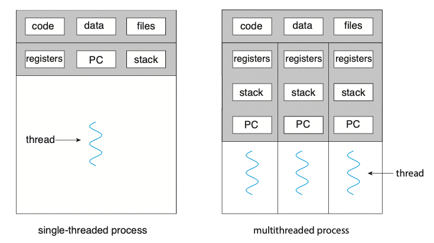

# 스레드와 병행성

## 1. 개요\_Overview

* 스레드는 CPU 이용의 기본 단위임
* <mark style="color:blue;">**스레드는 스레드 ID, 프로그램 카운터(PC), 레지스터 집합 그리고 스택으로 구성됨**</mark>
* <mark style="color:blue;">**스레드는 같은 프로세스에 속한 다른 스레드와 코드, 데이터 섹션, 그리고 열린 파일이나 신호와 같은 운영체제 자원들을 공유함**</mark>
* 전통적인 프로세스는 하나의 제어 스레드를 가지고 있음
* 만일 프로세스가 다수의 제어 스레드를 가진다면, 프로세스는 동시에 하나 이상의 작업을 수행할 수 있음
* 아래의 그림은 <mark style="color:red;">**단일 스레드**</mark> 프로세스와 <mark style="color:red;">**다중 스레드**</mark> 프로세스의 차이점을 보여주고 있음

### 1-1. 동기\_Motivation
