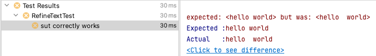
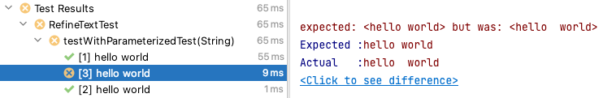

# 단위 테스트

> 단위 테스트는 테스트 주도 개발의 가장 중요한 도구임


인텔리제이에서 테스트 이름을 표시할 때, 공백 문자가 중복되는 경우 이를 제거하여 화면에 출력함\
이를 참고하여 실행 결과를 살펴보아야함


### 1. 단위 테스트 작성하기



```java
// 테스트 대상
// 입력으로 전달된 문자열의 공백이 중복되는 경우 처리하는 기능 수행
public class RefineText {

    public String refineText(String s) {
        return s.replace("    ", " ").replace("  ", " ");
    }

}
```



```java
public class RefineTextTest {

    private RefineText refineTextInstance = new RefineText();

    @Test
    @DisplayName("sut transforms \"hello  world\" to \"hello world\"")
    void test1() {
        String actual = refineTextInstance.refineText("hello  world");
        assertEquals("hello world", actual);
    }

    @Test
    @DisplayName("sut transforms \"hello    world\" to \"hello world\"")
    void test2() {
        String actual = refineTextInstance.refineText("hello    world");
        assertEquals("hello world", actual);
    }

    @Test
    @DisplayName("sut transforms \"hello   world\" to \"hello world\"")
    void test3() {
        String actual = refineTextInstance.refineText("hello   world");
        assertEquals("hello world", actual);
    }

}
```



.png>)



### 2. 루프를 통해 중복되는 로직 제거하기



```java
public class RefineTextTest {

    private RefineText refineTextInstance = new RefineText();

    @Test//여러 입력 중,어떤 입력에 대해 테스트가 실패했는지 알 수 없음
    @DisplayName("sut correctly works")
    void testWithLooping() {
        List<String> sources = List.of("hello  world", "hello    world", "hello   world");
        for (String source : sources) {
            String actual = refineTextInstance.refineText(source);
            assertEquals("hello world", actual);
        }
    }

}

```








어떤 입력에 대해 테스트가 실패 했는지 드러나지 않음


### 3. @ParameterizedTest를 사용해 누실된 입력 데이터 정보 얻기



```java
public class RefineTextTest {

    private RefineText refineTextInstance = new RefineText();

    //각 입력에 대한 테스트 결과를 출력해줌
    //단, JUnit에서 여러 공백 문자가 있을 시에 공백 처리를 해줘서 테스트 결과에는 다르게 표기되지 않는 문제가 있음
    @ParameterizedTest
    @ValueSource(strings = { "hello  world", "hello    world", "hello   world" })
    void testWithParameterizedTest(String source) {
        String actual = refineTextInstance.refineText(source);
        assertEquals("hello world", actual);
    }

}
```










<mark style="color:blue;">`@ParameterizedTest`</mark>를 사용하기 위해 별도의 의존을 추가해줘야함

```
testImplementation 'org.junit.jupiter:junit-jupiter-params:5.8.1'
```

