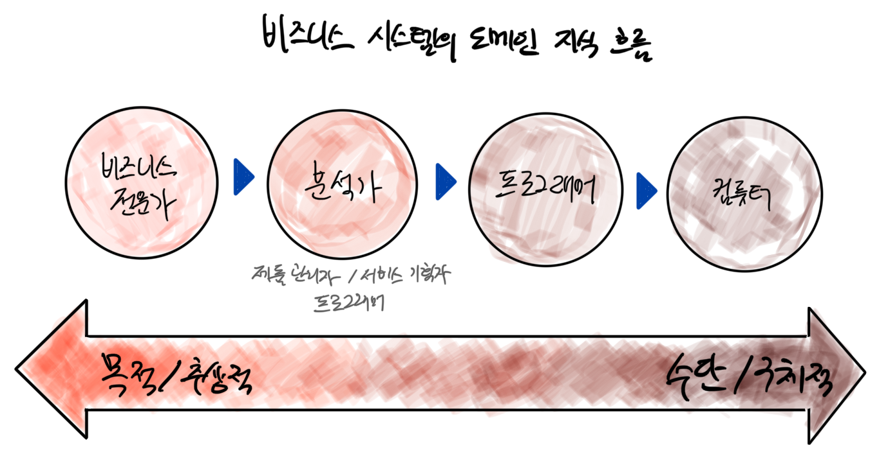

# 코드 기능 명세

* 소프트웨어는 문제를 푸는 도구
* <mark style="color:red;">**도메인은 소프트웨어가 풀어야 할 문제가 정의되는 공간**</mark>
* 비즈니스 시스템의 도메인은 비즈니스
* <mark style="color:red;">**문제를 충분히 이해하지 못하면 문제를 푸는 도구를 잘 만들 수 없다.**</mark>



* 문제를 가장 잘 이해
  * 시스템이 투영해야 할 핵심 지식의 원천
* 문제 설명력 부족
  * 지식의 저주
* 풀이도 가장 잘 이해한다고 착각
  * 문제를 말해야 할 때 풀이를 말하려는 경향을 가짐



* 비즈니스 전문가로부터 <mark style="color:red;">**시스템 요구사항을 발굴**</mark>
* 발굴된 요구사항의 오류 검색
* 발견된 문제점을 구현 작업 전에 협업을 통해 해결



* 정제된 기능 명세를 아키텍처와 코드로 번역
  * 제품 제작(소프트웨어 제작) 과정 중 비용이 가장 큰 작업
* 끊임 없는 설계 결정
* 지식 흐름 과정의 마지막 인간



* 코드를 통해 프로그래머로 부터 지식을 전달 받음
* 철저히 수동적
* 융통성 없음



* 컴퓨터는 스스로 설계를 결정하지 않기 때문에 프로그래머가 도메인 지식을 컴퓨터에 전달할 때엔 <mark style="color:red;">**모든 요소들이 명확히 결정될 수 밖에 없음**</mark>
* 충분히 명확한 도메인 지식을 확보하지 못한 프로그래머는 <mark style="color:red;">**지식 흐름 상류에 지식 보강을 요청해야 함**</mark>
* 하지만 어떤 프로그래머는 스스로 결정을 내림
  * 도메인 지식 투영에 오차 발생
  * 무책임하고 위험한 <mark style="color:red;">**도박**</mark>
