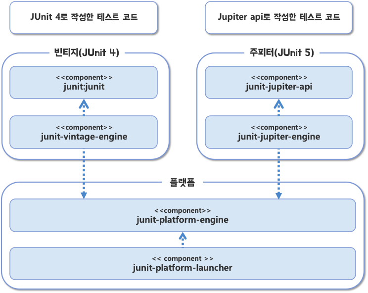

# JUnit 5 기초

## 1. JUnit 5 모듈 구성

* <mark style="color:blue;">**JUnit 플랫폼**</mark>**:** 테스팅 프레임워크를 구동하기 위한 **런처**, 테스트 엔진을 위한 **API**를 제공
* <mark style="color:blue;">**JUnit 주피터(Jupiter)**</mark>**:** JUnit5를 위한 테스트 API와 실행 엔진을 제공
* <mark style="color:blue;">**JUnit 빈티지(Vintage)**</mark>**:** JUnit3과 JUnit4로 작성된 테스트를 JUnit5 플랫폼에서 실행하기 위한 모듈을 제공



<details>

<summary><strong>JUnit 의존 추가 예제(Gradle)</strong></summary>

```groovy
plugins {
    id 'java'r
}

sourceCompatibility = '11'
targetCompatibility = '11'
compileJava.options.encoding = 'UTF-8'
compileTestJava.options.encoding = 'UTF-8'

repositories {
    mavenCentral()
}

dependencies {
    // JUnit Jupiter 의존 추가
    testImplementation('org.junit.jupiter:junit-jupiter:5.5.0')
    testImplementation('org.mockito:mockito-core:2.26.0')
}

test {
    // JUnit Platform 의존 추가
    useJUnitPlatform()
    testLogging {
        events "passed", "skipped", "failed"
    }
}
```

</details>

* 그레이들 4.6 버전부터 JUnit 5 플랫폼을 지원
  * 그 이전 버전을 사용하고 있다면 JUnit 4 버전을 사용하거나 그레이들 버전을 올려야함
* `junit-jupiter` 모듈은 JUnit 5.4 버전부터 제공
* JUnit5.3 버전 이하에서는 `junit-jupiter-api`와 `junit-jupiter-engine` 모듈을 각각 설정필요

## 2. @Test 애노테이션과 테스트 메서드

* 일반적으로 테스트 클래스 이름에 'Test'를 접미사로 붙임
* 테스트를 실행할 메서드(테스트 메서드)에 `@Test` 애노테이션을 붙임
* 이때 `@Test` 애노테이션을 붙인 메서드는 <mark style="color:blue;">**private이면 안 됨**</mark>
* JUnit의 `Assertions` 클래스는 `assertEquals()` 메서드와 같이 값을 검증하기 위한 목적의 다양한 **정적 메서드**를 제공


**JUnit 5와 JUnit 4의 차이점**

JUnit 5와 JUnit 4 버전은 패키지 구조나 일부 제약 조건 등이 다르다. 예를 들어 JUnit 4에서는 `@Test` 애노테이션이 `org.junit` 패키지에 포함되어 있고, `assertEquals()` 메서드는 `org.junit.Assert` 클래스에 포함되어 있다. 이 외에도 몇 가지 차이점이 있다.


## 3. 주요 단언 메서드

| 메서드                                                        | 설명                                        |
| ---------------------------------------------------------- | ----------------------------------------- |
| **assertEquals(expected, actual)**                         | 실제 값(actual)이 기대하는 값(expected)과 같은지 검사    |
| assertNotEquals(unexpected, actual)                        | 실제 값(actual)이 특정 값(unexpected)과 다른지 검사    |
| assertSame(Object expected, Object actual)                 | 두 객체가 동일한 객체인지 검사                         |
| assertNotSame(Object unexpected, Object actual)            | 두 객체가 다른 객체인지 검사                          |
| assertTrue(boolean condition)                              | 값이 true인지 검사                              |
| assertFalse(boolean condition)                             | 값이 false인지 검사                             |
| assertNull(Object actual)                                  | 값이 null인지 검사                              |
| assertNotNull(Object actual)                               | 값이 null이 아닌지 검사                           |
| fail()                                                     | 테스트를 실패 처리                                |
| assertThrows(Class\<T> expectedType, Executable excutable) | executable을 실행한 결과로 지정한 타입의 익셉션이 발생하는지 검사 |
| assertDoesNotThrow(Executable executable)                  | executable을 실행한 결과로 익셉션이 발생하지 않는지 검사      |

* 주요 타입별로 `assertEquals()` 메서드가 존재
  * `assertEquals(int, int)`, `assertEquals(Long, Long)`
* `assertEquals(Object expected, Object actual)` 메서드는 인자로 넘겨 받은 객체의 `equals()` 메서드를 호출하여 두 객체를 비교
* 익셉션 발생 유무가 검증 대상이라면 `fail()` 메서드를 사용하는 것 보다 `assertThrows()`, `assertDoesNotThrow()` 메서드를 사용하는 것이 **더욱 명시적**

> 예제

<details>

<summary><code>assertThrows()</code> 메서드는 발생한 익셉션 객체를 리턴</summary>

```java
@Test
void test() {
  IllegalArgumentException thrown = assertThrows(IllegalArgumentException.class, () -> {
    AuthService authService = new AuthService();
    authService.authenticate(null, null);
  });
  assertTrue(thrown.getMessage().contains("id"));
}
```

</details>

<details>

<summary><code>assert</code> 메서드는 실패하면 다음 코드를 실행하지 않고 바로 익셉션 발생</summary>

```java
assertEquals(3, 5 / 2); // 검증 실패로 익셉션 발생
assertEquals(4, 2 * 2); // 이 코드는 실행되지 않음
```

</details>

<details>

<summary>만약 모든 검증을 실행하고 그중에 실패한 것이 있는지 확인하고 싶을 때 <code>assertAll()</code> 메서드 사용</summary>

```java
assertAll(
    () -> assertEquals(3, 5/2);
    () -> assertEquals(4, 2*2);
    () -> assertEquals(6, 11/2);
);
```

</details>

## 4. 테스트 라이프사이클

### 4-1. @BeforeEach 애노테이션과 @AfterEach 애노테이션

* <mark style="color:blue;">**JUnit은 각 테스트 메서드마다 다음 순서대로 코드를 실행**</mark>
  1. 테스트 메서드를 포함한 객체 생성
  2. (존재하면) `@BeforeEach` 애노테이션이 붙은 메서드 실행
  3. @Test 애노테이션이 붙은 메서드 실행
  4. (존재하면) `@AfterEach` 애노테이션이 붙은 메서드 실행



```java
import org.junit.jupiter.api.AfterEach;
import org.junit.jupiter.api.BeforeEach;
import org.junit.jupiter.api.Test;

public class LifecycleTest {

  public LifecycleTest() {
    System.out.println("Execute Constructor (Constructor)");
  }

  @BeforeEach
  void setUp() {
    System.out.println("Execute setup Method (@BeforeEach)");
  }

  @Test
  void a() {
    System.out.println("Execute Test Method A (@Test)");
  }

  @Test
  void b() {
    System.out.println("Execute Test Method B (@Test)");
  }

  @AfterEach
  void tearDown() {
    System.out.println("Execute tearDown Method (@AfterEach)");
  }

}
```



```
Execute Constructor (Constructor)
Execute setup Method (@BeforeEach)
Execute Test Method A (@Test)
Execute tearDown Method (@AfterEach)

Execute Constructor (Constructor)
Execute setup Method (@BeforeEach)
Execute Test Method B (@Test)
Execute tearDown Method (@AfterEach)
```



* <mark style="color:blue;">`@BeforeEach`</mark>는 테스트를 실행하는데 필요한 준비 작업을 할 때 사용
* <mark style="color:blue;">`@AfterEach`</mark>는 테스트를 실행한 후에 정리할 것이 있을 때 사용
* <mark style="color:blue;">`@BeforeEach`</mark>과 `@AfterEach`을 붙인 메서드는 `@Test`과 마찬가지로 **private이면 안됨**

### 4-2. @BeforeAll 애노테이션과 @AfterAll 애노테이션

* `@BeforeAll`은 클래스의 모든 테스트 메서드를 실행한 전에 실행
* `@AfterAll`은 반대로 클래스의 모든 테스트 메서드를 실행한 뒤에 실행
* **두 애노테이션 모두 정적 메서드에 붙여서 사용**

## 5. 테스트 메서드 간 실행 순서 의존과 필드 공유하지 않기

[https://gist.github.com/2dc8a9a9276b6a99b99bcf0babedb400](https://gist.github.com/2dc8a9a9276b6a99b99bcf0babedb400)

* **테스트 메서드가 특정 순서대로 실행된다는 가정하에 테스트 메서드를 작성하면 안됨**
* JUnit이 테스트 순서를 결정하긴 하지만 그 순서는 버전에 따라 달라질 수 있음
* **각 테스트 메서드는 서로 독립적으로 동작해야 함**
* **테스트 메서드가 서로 필드를 공유한다거나 실행 순서를 가정하고 테스트를 작성하면 안됨**
*   **Note**

    JUnit은 테스트 메서드의 실행 순서를 지정하는 방법을 제공하고 있다. 하지만 각 테스트 메서드는 독립적으로 동작해야 한다. 테스트 메서드 간에 의존이 생기면 이는 테스트 코드의 유지보수를 어렵게 만든다. 테스트 코드 역시 코드이므로 유지보수가 중요하다.

## 6. 추가 애노테이션: @DisplayName, @Disabled

* `@DisplayName` 애노테이션을 사용해서 테스트에 표시 이름을 붙일 수 있음
  *   **@DisplayName 예제**

      [https://gist.github.com/c629beabe2e2c510bb9ebb9221bc6de0](https://gist.github.com/c629beabe2e2c510bb9ebb9221bc6de0)
  *   **실행 결과**

      
* `@Disable` 애노테이션을 사용해서 특정 테스트를 제외할 수 있음
  *   **@Disable 예제**

      [https://gist.github.com/678541cdf53819ccd9afe80a87b4df02](https://gist.github.com/678541cdf53819ccd9afe80a87b4df02)
  *   **실행 결과**

      

## 7. 모든 테스트 실행하기

* 코드를 원격 리포지터리에 푸시하거나 코드를 빌드해서 운영 환경에 배포하기 전에는 모든 테스트를 실행해서 실패하는 테스트가 없는지 확인해야함
* 메이븐과 그레이들의 경우 각각 다음 명령어를 사용
  * mvn test
  * **gradle test**
* 그레이들의 build 태스크를 실행하면 테스트를 실행

## 8. JUnit 5 도큐먼트

[JUnit 5 User Guide](https://junit.org/junit5/docs/current/user-guide/#appendix)
