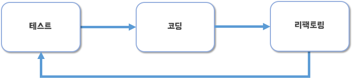

# TDD 시작

## 1. TDD란?

### 1-1. 기존 구현 방

* 일반적인 소프트웨어 구현 방식은 먼저 코드를 구현하고 그 다음 구현한 코드가 정상 동작하는지 확인 한 뒤 비정상적인 동작이 있으면 코드를 재작성하는 흐름을 가짐
* 작은 규모의 시스템의 경우 이러한 개발 방식은 빠른 결과물을 도출할 수 있으나, 시스템의 규모가 커질수록 개발 시간이 오래 걸리는 문제점을 가짐
* 예를 들어, 시스템의 기능이 5개 있을 경우 시스템 코드에 변경이 있었을 때 5개의 테스트만 수작업으로 진행하면 되지만 기능이 500개인 경우 한번의 코드 변경을 위해 500개의 기능을 수작업으로 테스트해야함

### **1-2. 테스트 주도 개발**

* <mark style="color:blue;">**TDD(Test-driven Development)**</mark>는 우리 말로 **'테스트 주도 개발'**이라고 표현하며, 구현을 먼저 하고 나중에 테스트하는 것이 아니라 **먼저 테스트를 하고 그 다음에 구현하는 개발 방식**
* 여기서 테스트를 먼저 작성한다는 것은 기능이 올바르게 동작 하는지 검증하는 테스트 코드를 작성한다는 것을 의미
* 기능을 검증하는 테스트 코드를 먼저 작성하고 테스트를 통과시키기 위해 개발을 진행

* 아래의 과정을 반복하면서 점진적으로 기능을 완성해 나가는 것이 전형적인 TDD의 흐름임
  1. 하나의 테스트 코드를 작성하면 테스트를 통과할 만큼만 코드를 작성
  2. 테스트를 통과한 뒤에는 개선할 코드가 있으면 리팩토링
  3. 리팩토링을 수행한 뒤에는 다시 테스트를 실행해서 기존 기능이 망가지지 않았는지 확인

* 테스트 코드를 작성하는 과정에서 테스트 대상이 될 클래스 이름, 메서드 이름, 파라미터 개수, 리턴 타입을 고민해야함
* 또한 새로운 객체를 생성할지 아니면 정적 메서드로 구현할지 등을 함께 고민함
* 이런 고민 과정은 실제 코드를 설계하는 과정과 유사

TDD를 통해 소프트웨어를 구현하면 다음과 같은 특징이 있음:

* **테스트가 개발을 주도**
* **지속적인 코드 정리**
* **빠른 피드백**

## 2. TDD예: 암호 검사기

[TDD예: 암호검사기](https://www.notion.so/TDD-141a1c91dd304b49b4c2519441eac089)

## 3. TDD 흐름

### 3-1. 테스트가 개발을 주도

* 테스트 코드를 먼저 작성하면 아래와 같은 이유로 테스트가 개발을 주도하게 됨
  * 테스트 코드를 만들면 다음 개발 범위가 정해짐
  * 테스트 코드가 추가되면서 검증하는 범위가 넓어질수록 구현도 점점 완성되어감

### 3-2. 지속적인 코드 정리

* 구현을 완료한 뒤에는 리팩토링을 진행
* 당장 리팩토링할 대상이나 어떻게 리팩토링해야 할지 생각나지 않으면 다음 테스트 진행
* 테스트 코드 자체도 리팩토링 대상
* 테스트 코드가 있으면 리팩토링을 보다 과감하게 진행할 수 있음
* TDD는 개발 과정에서 지속적으로 코드 정리를 하므로, 코드 품질이 급격히 나빠지지 않게 막아주는 효과가 있음
  * 이는 향후 유지보수 비용을 낮추는데 기여

### 3-3. 빠른 피드백

* TDD는 코드 수정에 대한 피드백이 빠름
* 코드가 변경되면 테스트를 실행하여 해당 코드가 올바른지 바로 확인할 수 있음
* 이를 통해 잘못된 코드가 배포되는 것을 방지할 수 있음
